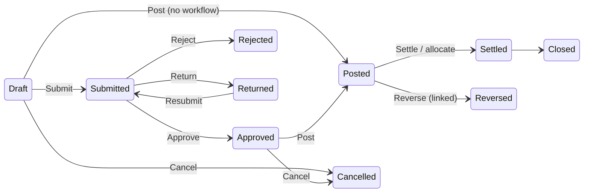

# Elixir Books — Product Design System

**Document status:** Draft for design, product, engineering and QA review
**Version:** 0.1
**Date:** 13 September 2026
**Product:** Elixir Books ERP
**Built on:** `design-system-product.md` (Innex / Enrolliq foundations, measured from 19 screens)
**Requirements baseline:** Elixir Books BRD v1.2 · PRD v1.2 · FRD v1.2 (07 September 2026)

The Product Design System reconstructed two shipped products as two *themes* over one set of foundations — app-shell anatomy, sidebar grammar, table construction, pill species, type scale, radius scale and a 4 px grid. **Elixir Books is the third product on those foundations.** It inherits them unchanged and adds what a multi-tenant financial ERP needs and the screenshots could not show: a tenant/company/branch/period context model, document state machines, money and tax presentation, dense editable line grids, controlled financial actions, statutory document rendering, and the interaction, accessibility and state layer the source document lists as gaps (§11 there → §10 and §7.23 here).

---

## 0. How to read this document

| Marker | Meaning |
|---|---|
| *Inherited* | Measured in the source design system; reused unchanged. Section numbers in brackets (e.g. *src §6.5*) point there. |
| *Derived* | Computed from an inherited value by a stated rule (e.g. hover = accent mixed with 8 % black). |
| *Specified* | New to Elixir Books. No screenshot evidence exists; chosen against the BRD/PRD/FRD and WCAG 2.1 AA, to be validated in the first design review. |
| `FR-…` `EP-…` `BRule-…` `NFR-…` `BO-…` | The requirement a rule serves (FRD / PRD / BRD). The FRD (§1) requires design screens to reference requirement IDs; this document does so at the pattern level, and §13 gives the screen-level map. |

Precedence when documents disagree: **BRD / PRD / FRD → this document → source design system.** Every deviation from the source is called out with its reason (there are three: `--text-tertiary`, the warning/outline label colours, and a dense row height).

Sample values in diagrams (`Arlene Traders`, `27AAAPL1234C1Z5`, `INV/26-27/0118`) are illustrative only.

---

## 1. Product context that shapes the system

### 1.1 What is being designed

A subscription ERP for businesses running one or more legal companies, branches, warehouses and stores (BRD §1). Every commercial event — quote, order, delivery, invoice, receipt, PO, GRN, bill, payment, POS sale, payroll run, depreciation — flows through one posting engine, one tax engine and one inventory engine (BRD §3.1). India is the first localization, but the core is country-neutral and multi-currency (BRD §13A). The web app is the first complete client; mobile and desktop consume the same APIs (PRD §14).

Three facts about the product drive most of what differs from the source system:

1. **Posted data is immutable** (BRule-02, FR-ACC-015). The UI never offers "edit" or "delete" on a posted document; it offers *reverse*, *cancel*, *credit/debit note*, *adjust* — each linked to its source. The action vocabulary, confirmation dialogs and status taxonomy all follow from this.
2. **Context is mandatory** (BRule-12, FR-3.1). Every screen is scoped to a tenant, a company, usually a branch and often a financial period. The shell must show that scope permanently and switching it must visibly refresh permissions, currency, time zone, period and module availability.
3. **Consequences are automatic and must be inspectable** (PRD §4). A user works in business language (invoice, receipt, GRN) while the resulting journal, stock movement and tax snapshot stay one click away. Hence the *Accounting* tab, the calculation-explanation popover and the snapshot tag.

### 1.2 Who uses it and what that demands

| Persona (PRD §3) | Dominant activity | Design consequence |
|---|---|---|
| Accountant, Finance approver | Ledgers, journals, reconciliation, close | Dense tabular density (§4.5), keyboard-first grids (§10.3), Dr/Cr discipline (§2.4), period lock always visible (§5) |
| Sales / Purchase executive | Fast document entry, lookup, conversion | Entity pickers that search large masters (§7.4), line grid with Tab/Enter flow (§7.8), source-linked conversion (§6.4) |
| Warehouse user | Receive, issue, transfer, count | Quantity + UOM cells, batch/serial columns, transfer state chips (§8) |
| Cashier | Rapid billing under time pressure | Full-bleed POS layout, 48 px targets, tender control, connectivity indicator (§6.7) |
| Company / Tenant admin | Setup, masters, imports, roles | Wizard + checklist shells (§6.5), import row-error table (§7.16), entitlement surfaces (§7.21) |
| CFO | Scan, drill, trust | KPI tiles with scope/period/currency/freshness (§7.18), drill-down from statement to journal (FR-ACC-023) |
| Auditor | Reconstruct | Immutable activity timeline with actor, time, correlation ID (§7.13) |

### 1.3 Editions and business-nature profiles

Two orthogonal switches shape navigation and terminology, neither of which weakens permissions or accounting rules (BRD §10, §10A; EP-01, EP-19):

| Switch | Values | What it changes in the UI |
|---|---|---|
| **Edition** (subscription entitlement) | Lite / Smart Invoicing · Pro / Books ERP · Enterprise | Which modules exist in navigation and which actions are rendered. Unentitled features are *absent*, not disabled (EP-01: "unavailable in UI and rejected by API"). The tenant owner alone sees plan, limits, usage and upgrade surfaces. |
| **Business-nature profile** (company operating profile) | Trading · Services · Manufacturing · Hybrid | Default module set, navigation order, terminology, dashboard KPIs, onboarding checklist, report packs. Profile-irrelevant capabilities are hidden from normal navigation but stay reachable by direct link if entitled and permitted (EP-19 acceptance). |

The design system therefore treats **navigation labels, dashboard tiles and onboarding steps as slots filled by the effective profile pack**, never as fixed copy. A Services company sees `Projects & contracts`; a Manufacturing company sees `Production`; both share every token and component here.

### 1.4 Experience principles → design rules

PRD §4 states the principles; the rules below are how this system enforces them.

| PRD principle | System rule | Where |
|---|---|---|
| Context is always visible | A 48 px context bar (company · branch · FY · period · lock state) is part of the shell on every authenticated page; document state is pinned in the identity rail | §5, §6.1, §6.4 |
| Drafting is forgiving; posting is controlled and explicit | Drafts autosave and validate softly; `Post`, `Reverse`, `Approve payment batch`, `Lock period` always go through the financial confirmation dialog with consequence list and reason | §7.11 |
| Business language, inspectable accounting | Document pages carry an `Accounting` tab showing the journal; tax and price cells open a calculation explanation | §6.4, §7.10 |
| Validation close to the field, explains how to resolve | Field-level error text names the fix; form-level summary links to fields; API errors carry a correlation ID | §7.12 |
| Registers are consistent | One register anatomy for every module: header, filter tabs with counts, toolbar, table, scope-labelled totals, pagination, five non-happy states | §6.3 |
| Destructive or financial actions show consequences | Verb-labelled buttons, danger variant only for irreversible outcomes, no "OK" | §7.1, §7.11 |
| Mobile prioritises approvals, dashboards, capture, lookup | Responsive rules collapse registers to card rows and hide line-grid editing below 768 px | §11 |
| Light skeuomorphism, restrained depth, high readability, finance-grade density | See §1.5 | §4.4, §4.5 |

### 1.5 Ruling on the visual direction

PRD §4 asks for "light skeuomorphism with restrained depth, high readability, and finance-grade density". The source system is border-first with a four-level elevation ladder and low-chroma gradient backdrops. This document reads the PRD phrase as **that system, not more**:

- *Restrained depth* = the inherited elevation ladder (§4.3). Level 0 flat for everything inside the app frame; shadow only for genuine layering (menus, popovers, modals, the app frame itself).
- *Light skeuomorphism* = the inherited backdrop meshes on auth/onboarding, the payment-card visual in POS/tender, and the printable invoice surface. No gradients, bevels or textures on controls or data surfaces.
- *High readability* = the inherited type scale, plus the `--text-tertiary` correction in §2.1.
- *Finance-grade density* = a third, dense row height for ledgers and line grids (§4.5), tabular numerals everywhere, and two-line cells that pack an identifier under a name.

Design lead to confirm this reading at the first review (§14).

---

## 2. Foundations — colour

### 2.1 Neutrals

Inherited unchanged from *src §2.1* with one deviation.

| Token | Hex | Provenance | Used for |
|---|---|---|---|
| `--surface` | `#FFFFFF` | Inherited | Cards, table rows, sidebar, modals, inputs, document pages |
| `--surface-subtle` | `#F9FBFC` | Inherited | Table header, toolbar strips, totals ladders, summary blocks, context bar |
| `--surface-muted` | `#F7F7F7` | Inherited | App chrome behind the frame on compact layouts |
| `--surface-sunken` | `#F3F5F7` | Inherited | Segmented-control track, active nav row, bulk-action bar, disabled fills |
| `--border-hairline` | `#F5F5F5` | Inherited | Table row dividers |
| `--border-subtle` | `#EFEFEF` | Inherited | Sidebar / panel separators |
| `--border-default` | `#EAEAEA` | Inherited | Input, card and list-row borders |
| `--border-strong` | `#E0E2E6` | Inherited | Section dividers on document pages, totals-ladder rule above `Total` |
| `--track` | `#EBEBEB` | Inherited | Progress, meter and skeleton tracks |
| `--text-primary` | `#0A0A0A` | Inherited | Headings, primary cells, nav labels, amounts |
| `--text-secondary` | `#5F6368` | Inherited | Labels, table headers, subtitles |
| `--text-tertiary` | **`#6E6E71`** | **Specified — deviation** | Second line of two-line cells, timestamps, helper text. Source value `#79797B` measures ≈4.3:1 on white, below WCAG AA 4.5:1 for the 12 px text it is used on; `#6E6E71` measures ≈5.1:1 (NFR-09). |
| `--text-on-accent` | `#FFFFFF` | Inherited | Labels on filled buttons |
| `--scrim` | `rgba(0,0,0,.19)` | Inherited | Behind modals and sheets |

### 2.2 Theme C — Elixir Books

No Elixir brand asset exists in the source set, so the accent is a **slot**. It defaults to the Innex blue because that value was measured at 83–96 % purity on four buttons and already has a verified tint ladder; a brand-specific hue can replace it later by re-deriving the four tints and two states below.

| Token | Hex | Provenance | Notes |
|---|---|---|---|
| `--accent` | `#325CFF` | Inherited (Innex) — **pending brand sign-off** | Primary buttons, links, focus ring, active tab underline, selected controls |
| `--accent-hover` | `#2E55EB` | Derived: accent mixed with 8 % black | Primary hover |
| `--accent-active` | `#2B4FDB` | Derived: accent mixed with 14 % black | Primary pressed |
| `--accent-tint` | `#ECF1FD` | Inherited | Tinted button fill, info note callout, selected row in pickers |
| `--accent-tint-weak` | `#F2F7FF` | Inherited | Selected radio card / profile card |
| `--accent-tint-weakest` | `#F5F8FF` | Inherited | Selected chip in a chip group |
| `--nav-active` | `#F2F4F8` | Inherited (Innex) | Active sidebar row — the neutral tint, not the Enrolliq cyan |
| `--link` | `#325CFF` | Inherited | Document-number links, party links, drill-down links |

### 2.3 Semantic set

The two source products used different semantic sets (soft pastels in Innex, saturated pastels in Enrolliq). Elixir Books uses **one set, the soft Innex species**, extended with a warning pair and a terminal-neutral pair that an ERP needs. Every pair below is a *status badge* (tinted fill, no border) unless stated.

| Meaning | Fill | Label | Provenance | Used for |
|---|---|---|---|---|
| Success | `#E0F9EC` | `#12784E` | Inherited | Posted, Approved, Accepted, Completed, Matched, Active, period Open |
| Danger | `#FFE8EA` | `#C0393F` | Inherited (*approx.*) | Rejected, Failed, Overdue, Suspended, Blocked, QC Rejected |
| Warning | `#FEF4EC` | `#8A4B0F` | Fill inherited (note-attention); label **specified** for ≈5.6:1 | Returned, Partially fulfilled, Exception, Held, Grace, Soft-closed, Reopened, Unmatched |
| Info | `#EBF7FF` | `#3E5BA5` | Inherited (*approx.*) | Submitted, Queued, In progress, Released, Trial, Reserved |
| Neutral | `#F3F5F5` | `#5F6368` | Inherited | Draft, Ready, Not required, Planned |
| Muted-strong | `#E7E9EB` | `#3C4043` | Fill inherited; label **specified** (≈8.6:1) | Terminal, non-error states: Closed, Cancelled, Reversed, Short closed, Expired, Locked |
| Note — info | `#ECF1FD` | body `#0A0A0A` | Inherited | Informational callouts in timelines and forms |
| Note — attention | `#FEF4EC` | body `#0A0A0A` | Inherited | Attention callouts ("This period is soft-closed") |

**Outline pills** (near-white fill, 1 px tinted border, coloured label) encode a *derived assessment*, never a record state — ageing bucket, match confidence, credit exposure, budget variance, stock health. Fills and borders are inherited from Enrolliq; **labels are changed** because the source labels measure ≈2.2–2.8:1:

| Level | Fill | Border | Label | Provenance |
|---|---|---|---|---|
| Critical | `#FFF5F6` | `#E0455A` | `#C0393F` | Fill/border inherited; label specified (≈5.0:1) |
| Warning | `#FFF7E8` | `#E29A4B` | `#8A4B0F` | Fill/border inherited; label specified (≈6.4:1) |
| Good / None | `#F1FFF8` | `#3FA97A` | `#12784E` | Fill/border inherited; label specified (≈5.3:1) |

A single-segment meter (inherited *src §2.3*) is coloured by band — high `#7A1E22`, mid `#F59E0B`, low `#22C55E` on `--track` — and is used for credit-limit utilisation, budget consumption and stock-cover.

### 2.4 Financial colour rules

Colour on numbers is rationed. These are the only cases (BRule-01, FR-RPT-010, FR-RPT-011):

| Case | Treatment |
|---|---|
| Ledger Dr / Cr columns | No colour. Separate columns, tabular, right-aligned. Never a signed single column. |
| Credits, advances and negatives in a totals ladder | `--fin-positive` `#12784E` with a true minus (`−₹ 600.00`) — inherited from the invoice `ADVANCE` line |
| Unfavourable variance, overdue amount, exchange loss | `--fin-negative` `#C0393F` |
| Favourable variance, exchange gain | `--fin-positive` |
| Base-currency equivalent under a foreign amount | `--text-tertiary`, 12 px, second line of the cell |
| Links (document numbers, parties) | `--link` |

Everything else — including large numbers, totals and the `DUE` line — is `--text-primary` with weight, not hue, for emphasis.

### 2.5 Categorical colours

For charts, dimension chips and profile tiles. Inherited from the room-type tiles and OTA marks (*src §4.4, §2.2*), extended to six. Categorical only; never reused for status.

| Slot | Hex | Provenance |
|---|---|---|
| cat-1 | `#325CFF` (accent) | Inherited |
| cat-2 | `#F97316` | Inherited (orange tile) |
| cat-3 | `#22C55E` | Inherited (green tile) |
| cat-4 | `#38BDF8` | Inherited (sky tile) |
| cat-5 | `#A855F7` | Specified |
| cat-6 | `#FF9E44` | Inherited (Agent chip) |

Business-nature profile tiles in onboarding use cat-2 Trading, cat-4 Services, cat-3 Manufacturing, cat-5 Hybrid.

### 2.6 Backdrops

Inherited (*src §2.4*). Used **only** on auth, onboarding wizard and the presentation layer. Inside the app frame every surface is a neutral from §2.1. The Innex app-page backdrop (`#E8F2FA → #E0F0FC`) sits behind the app frame on ≥1440 px layouts; below that the frame fills the viewport on `--surface-muted`.

---

## 3. Foundations — typography

Inherited scale and font stack (*src §3*), with three ERP additions.

```
font-family: Inter, "SF Pro Text", -apple-system, "Segoe UI", system-ui, sans-serif;
font-feature-settings: "tnum" 1;   /* all numbers, money, quantities and identifiers */
```

| Role | Size / line-height | Weight | Used for |
|---|---|---|---|
| Display | 24 / 32 | 600 | KPI tile value, document total in the identity rail, POS payable amount |
| Page title (H1) | 20 / 28 | 600 | Register titles (`Sales invoices`), dashboard titles |
| Entity title (H2) | 20 / 28 | 600 | Document number / party name in the identity rail |
| Section title (H3) | 16 / 24 | 600 | Document sections (`Lines`, `Tax breakup`), card headers, widget titles |
| Body / table cell | 14 / 20 | 500 primary · 400 secondary | Cells, form values, dialog copy |
| Small / meta | 12 / 16 | 400 | Second cell line, helper text, timestamps, base-currency equivalent |
| Overline / field label | 11 / 16, `+0.04em`, uppercase | 500 | Field labels in rails and summary blocks, sidebar group labels, ladder labels |
| Badge / pill | 11–12 / 16 | 500 | All status badges, outline pills, count badges |
| Identifier | 14 / 20 or 12 / 16 | 500, `tnum` + `+0.02em` | **Specified.** Document numbers, GSTIN/PAN, IRN, UTR, batch/serial. Same family, tracked slightly so fixed-width codes scan. |

Rules (inherited ones marked ●, specified ones ○):

- ● Two-line cells pair 14 px/500 primary over 12 px/400 tertiary: `Arlene Traders` over `27AAAPL1234C1Z5`; `USD 10,000.00` over `₹ 8,32,000.00`.
- ● Every uppercase label is 11 px, letter-spaced, `--text-secondary`.
- ● Money is tabular, right-aligned in tables; the currency symbol or code is never superscripted.
- ○ Every numeric column (money, quantity, rate, %, Dr, Cr, balance) is right-aligned; text and identifiers left; status centred-left with the badge.
- ○ Labels are translation-ready: no string concatenation, no sentence built from a number and a noun (`{count} invoices` is one message key), no ordinal suffixes (the source's `21th` bug is a content error and is banned here) (BRD §13 Localization, NFR-15).
- ○ Terminology comes from the effective profile pack; the system supplies label *slots* (§1.3).

---

## 4. Foundations — space, radius, elevation, density, icons

### 4.1 Grid and measures

4 px base, inherited steps **4, 8, 12, 16, 20, 24, 32, 40, 48**.

| Measure | Value | Provenance |
|---|---|---|
| Sidebar width | 250 px | Inherited |
| Sidebar collapsed (icon rail) | 64 px | Specified (§11) |
| Context bar height | 48 px | Specified |
| Identity rail width (document page) | 340 px | Inherited (*src §5.2*) |
| Pinned footer height | 64 px | Specified: 40 px button + 12 px vertical padding |
| Content padding | 24 px | Inherited |
| Input height | 48 px (forms) · 40 px (grid cells, toolbar filters) | Inherited · Specified |
| Button height | 40 px default · 32 px compact toolbar | Inherited |
| Segmented control | 56 px (POS tender) · 40 px (in toolbars) | Inherited · Specified |
| Wizard card width | 1160 px; form column 604 px | Inherited |
| Touch target minimum (POS, mobile) | 48 px | Specified (NFR-09) |

### 4.2 Radius

Inherited: `--r-xs` 6 · `--r-sm` 8 · `--r-md` 12 · `--r-lg` 16 · `--r-full` 9999. Application is unchanged; the line-item grid uses **no** radius on cells and `--r-md` on its container.

### 4.3 Borders and elevation

Inherited ladder (*src §4.3*), with the layering assignments an ERP needs:

| Level | Treatment | Where |
|---|---|---|
| 0 — flat | 1 px `--border-default`, no shadow | Cards, inputs, panels, line grid, document sections, KPI tiles |
| 1 — raised | 1 px border + `--shadow-1` | Active segment, active filter tab, sticky totals row, sticky grid header |
| 2 — floating | `--shadow-2` | Menus, popovers (calculation explanation), date/period pickers, the app frame on its backdrop |
| 3 — modal | `--scrim` + `--shadow-2` | Financial confirmation dialog, sheets, import wizard, POS tender sheet |

Table dividers stay `--border-hairline` so rows read as texture. The line-item grid adds a `--border-strong` rule above its totals row.

### 4.4 Depth ruling

See §1.5. No control inside the app frame carries a gradient, inner shadow or bevel. The two permitted skeuomorphic surfaces are the payment-card visual (inherited *src §6.16*, used in POS card tender and supplier bank details) and the printable document (inherited *src §6.14*, extended in §7.22).

### 4.5 Density

**Specified.** The source measured two row heights; ledgers and line grids need a third.

| Mode | Row height | Cell padding (h / v) | Used for |
|---|---|---|---|
| Rich | 72 px | 16 / 16 | Rows whose identity cell has avatar + two lines (customers, suppliers, employees) |
| Default | 56 px | 16 / 12 | All registers |
| Dense | **40 px** | 12 / 8 | Line-item grid, ledger and day-book views, trial balance, reconciliation panes, POS cart |

Density is a per-table property, not a global user setting, in the first release; a user-level toggle is a §14 decision. Row height changes never change font size — dense mode keeps 14 / 12 px text and removes vertical padding only.

### 4.6 Iconography

Inherited (*src §4.4*): single-weight 1.5 px line icons, 16 px in nav/cells/buttons, 20 px in section headers, monochrome `--text-secondary`. ERP additions, all monochrome: lock (locked period, masked field), link (source document), snapshot (frozen master data), shield-check (e-invoice accepted), arrows-swap (reverse), split (partial fulfilment), scale (Dr/Cr, matching). Brand marks appear only for bank logos in bank-account rows and payment providers in tender chips, in the inherited 32 px rounded tile.

---

## 5. Context model

**Specified** — the biggest structural addition. Serves BRule-12, FR-3.1 (context), FR-ORG-005 (period state), FR-IAM-004 (multi-company access), PRD §4 "context is always visible".

```
┌ context bar · 48 px · --surface-subtle · 1 px --border-subtle below ─────────────────────────┐
│ Sales › Invoices                 Acme Pvt Ltd ▾ · Mumbai ▾ · FY 2026–27 · Apr 2026 ● Open  ⌘K 🔔 ◯ │
└───────────────────────────────────────────────────────────────────────────────────────────────┘
```

| Element | Behaviour |
|---|---|
| Breadcrumb | Module › register › document number. Truncates from the left. |
| Company switcher | 32 px compact secondary button with company name + chevron. Opens a searchable list of companies the user may access (FR-IAM-004). Each row: company name over ISO country · base currency (`IN · INR`) as a two-line cell. Switching **reloads the page in the new scope** and shows a one-line success banner "Now working in Acme Pvt Ltd · Mumbai" — because permissions, defaults, currency, time zone, period and module availability all change (FR-3.1). |
| Branch switcher | Same control; hidden when the company has one branch. |
| Financial-year chip | Neutral chip, label from the company fiscal calendar (`FY 2026–27`), never assumed April–March (PRD §14). |
| Period chip | Label + state dot: Open (success), Soft-closed (warning), Locked (muted-strong + lock icon), Reopened (warning). Opens the period picker (§7.2). When the current business date falls in a locked period, the chip becomes a warning banner on any create/post screen: "Apr 2026 is locked. Posting is disabled — request reopen." with a link to the reopen request (FR-ORG-005). |
| Global search | Inherited search field idiom with `⌘K` / `Ctrl K` hint chip (Windows shows `Ctrl`). Searches documents, parties, items and menu items within the current scope. |
| Notifications | Ghost icon button with count badge. Panel lists approval requests, integration outcomes, import/export results, due/overdue (PRD §11). |
| User | Avatar; menu holds profile, active sessions, sign out. The tenant/plan line (`Pro · renews 01 Apr 2027`) appears here for the tenant owner only. |

The **tenant** is not shown in the bar — a user session belongs to exactly one tenant — but it appears in the sidebar brand block (tenant name above company name) so support screenshots are unambiguous (E2E-04).

Document state lives on the document page (identity rail, §6.4), not in the bar.

---

## 6. Layout patterns

### 6.1 App shell

Inherited anatomy (*src §5.1*) plus the context bar.

```
┌ app frame · radius 16 · shadow-2 on backdrop (≥1440) · fills viewport below ───────────────┐
│ ┌ sidebar 250 ──┐ ┌ context bar 48 ───────────────────────────────────────────────────────┐ │
│ │ tenant        │ ├─────────────────────────────────────────────────────────────────────────┤ │
│ │ Company ▾     │ │ page header: title + subtitle (scope / count) │ secondary · primary   │ │
│ │ ──────────────│ │ ───────────────────────────────────────────────────────────────────── │ │
│ │ WORKSPACE     │ │ filter tab bar (counts) │ search · filters · saved view · columns     │ │
│ │  · Home       │ │ ───────────────────────────────────────────────────────────────────── │ │
│ │  · Approvals ⁷│ │ table / document / dashboard                                          │ │
│ │ OPERATIONS    │ │                                                                       │ │
│ │  · Sales      │ │                                                                       │ │
│ │  · …          │ │ ───────────────────────────────────────────────────────────────────── │ │
│ │ ⌄ Help · Settings │ totals · pagination   or   pinned action footer                     │ │
│ │   user card   │ │                                                                       │ │
│ └───────────────┘ └───────────────────────────────────────────────────────────────────────┘ │
└──────────────────────────────────────────────────────────────────────────────────────────────┘
```

The sidebar brand block is a two-line cell: tenant name (12 px tertiary) over company name (14 px/500) with a trailing chevron — it *is* the company switcher on narrow layouts where the context bar drops the switcher.

### 6.2 Navigation

The PRD §5 information architecture (17 areas) is grouped into six sidebar groups (inherited group-label grammar, *src §6.6*). Order within a group follows the profile pack; the groups themselves are fixed.

| Group label | Items (PRD §5) | Visibility rule |
|---|---|---|
| WORKSPACE | Home / role dashboard · Approvals & activity | Always |
| OPERATIONS | CRM · Sales · Purchase · Inventory · POS · *Projects & contracts* (Services) · *Production* (Manufacturing) | Edition + profile |
| FINANCE | Accounting · Banking · Taxation · Payroll · Fixed assets · Budgets & expenses | Edition + profile |
| INSIGHT | Reports & CFO dashboard | Always; content by permission |
| SETUP | Masters & imports · Company administration | Permission |
| PLATFORM | Platform administration | Platform users only (FR-PLT-001) |

Rules:

- Count badges (inherited species 4) appear only on `Approvals` (pending for me) and on register filter tabs — never on module items.
- Lite edition renders WORKSPACE, `Sales` (invoices, receipts), `Reports`, SETUP. Nothing else is rendered; there are no locked or greyed items in the nav (EP-01). The upgrade path lives in *Company administration › Plan & usage* (§7.21).
- Profile-hidden modules are removed from the nav but remain routable; a direct link to one renders normally if entitled and permitted, otherwise the no-permission state (§7.23).
- Active row: `--nav-active` fill, label `--text-primary`. Group labels 11 px uppercase `--text-secondary`.
- Below 1440 px the sidebar collapses to a 64 px icon rail with tooltips; below 1024 px it becomes a drawer (§11).

### 6.3 Register page

One anatomy for every module register (FR-MDM-002, FR-RPT-001, PRD §10 "all major registers shall provide…").

```
┌ page header ──────────────────────────────────────────────────────────────────────────────┐
│ Sales invoices                                        [Import] [Export ▾]  [+ New invoice] │
│ 118 posted · ₹ 42,18,600.00 outstanding · Mumbai branch · FY 2026–27                       │
├ filter tab bar ───────────────────────────────────────────────────────────────────────────┤
│ (All 131) (Draft 4) (Awaiting approval 2) (Posted 118) (Overdue 6) (Cancelled 1)           │
├ toolbar ──────────────────────────────────────────────────────────────────────────────────┤
│ 🔍 Number, party, reference…   [Filters · 2] [Saved view: Mine ▾]    [Columns] [Sort ▾]     │
├ table · header on --surface-subtle ───────────────────────────────────────────────────────┤
│ ☐ │ Number ↕        │ Date        │ Customer                 │ Status  │ Amount ↕        │ Due         │ ⋮ │
│ ☐ │ INV/26-27/0118  │ 21 Apr 2026 │ Arlene Traders           │ Posted  │  ₹ 1,18,000.00  │ 21 May 2026 │ ⋮ │
│   │                 │             │ 27AAAPL1234C1Z5          │         │                 │ Overdue 12d │   │
│ … 56 px rows · 1 px #F5F5F5 dividers · no zebra                                            │
├ totals · scope-labelled · sticky · level 1 ───────────────────────────────────────────────┤
│ Totals for 118 filtered rows                              ₹ 1,42,08,400.00                 │
├ pagination ───────────────────────────────────────────────────────────────────────────────┤
│ Show 25 ▾ per page · 1–25 of 118                                        ‹ 1 2 3 … 5 ›      │
└───────────────────────────────────────────────────────────────────────────────────────────┘
```

| Zone | Rule | Requirement |
|---|---|---|
| Header subtitle | Always carries scope and count (inherited rule); for financial registers, also the headline amount for the scope | PRD §8 content rule; FR-RPT-006 |
| Filter tabs | Pills with counts (inherited); the set is the register's status taxonomy (§8) plus derived tabs the persona needs (`Overdue`, `Awaiting my approval`). Counts respect data scope. | FR-MDM-002, FR-RPT-007 |
| Filters | Chips on a `Filters · n` secondary button open a panel: date range (defaults to the open period), company/branch (if multi), status, party, amount range, module-specific. Applied filters render as removable chips under the toolbar. Filter state is in the URL where safe. | PRD §10 |
| Saved views | Select; `Mine` / `Shared` sections; "Save current view" action. A shared view never widens data scope. | PRD §10 |
| Columns | Column configurator sheet: show/hide, reorder, pin first column. Money columns cannot be moved left of the identity column. | PRD §10 |
| Totals row | Sticky at the table foot, level 1. Label states scope explicitly — "Totals for 118 filtered rows", never "Total" — and mixed-currency scopes show one line per currency plus a base-equivalent line. | PRD §10 "totals calculated for clearly identified result scope" |
| Pagination | Inherited Enrolliq form (`Show 25 ▾ per page · 1–25 of 118` left, pager right). Cursor-based under the hood for large registers (FRD §21.1); the pager then shows `‹ Prev · Next ›` without page numbers. | FRD §21.1 |
| Export | `Export ▾` offers CSV / XLSX / PDF. Above the async threshold the dialog says "This export runs in the background; you'll be notified" and the job appears in notifications with expiry (FR-RPT-008). Exports carry the applied filter/scope metadata and respect masking (FR-EXPORT-001). | FR-RPT-008 |
| Bulk actions | Selecting rows swaps the toolbar for a `--surface-sunken` bulk bar: `3 selected · Submit · Export · Clear`. Only actions valid for *every* selected row appear. | PRD §10 |
| Row drill-down | Row click opens the document page; number is also a link. Trailing `⋮` holds row actions valid for that row's state. | PRD §10 |
| States | Empty (first-run vs filtered), loading, error, stale, no-permission — §7.23 | PRD §10 |

### 6.4 Document page

Adapts the inherited split-detail overlay (*src §5.2*: identity rail + detail pane + pinned footer) into a full page, because an ERP document is a destination, not a peek. Serves PRD §10 "document pages shall provide…", FR-3.4, FR-WFL-008, FR-ACC-023.

```
┌ context bar ───────────────────────────────────────────────────────────────────────────────┐
│ Sales › Invoices › INV/26-27/0118                 Acme Pvt Ltd ▾ · Mumbai ▾ · FY 2026–27 · Apr 2026 ● Open │
├ identity rail 340 · sticky ─┐┌ detail pane · scrolls ───────────────────────────────────────┤
│ INV/26-27/0118              ││ Details · Approvals · Accounting · Activity   ← underline tabs │
│ [Posted] [e-Invoice · Accepted] │ ───────────────────────────────────────────────────────────── │
│                             ││ Header                                                         │
│ ₹ 1,18,000.00     TOTAL     ││   Date · Due · Payment terms · Salesperson · Reference · …     │
│ ₹ 18,000.00       DUE       ││ Party & addresses                                              │
│ 21 May 2026 · Overdue 12 d  ││ Lines                    ← dense grid (§7.8), read-only here   │
│ ─────────────────────────── ││ Charges & discounts                                            │
│ CUSTOMER          ⧉ snapshot ││ Tax breakup              ← by component / rate / HSN (§7.9)    │
│ Arlene Traders              ││ Totals                   ← ladder (§7.9)                        │
│ 27AAAPL1234C1Z5             ││ Terms                                                          │
│ Contact · Addresses  ← tabs ││ Attachments              ← document rows (§7.17)                │
│ ─────────────────────────── ││                                                                │
│ SOURCE                      ││                                                                │
│ SO/26-27/0092 → DC/26-27/0075 │                                                              │
│ STATUTORY                   ││                                                                │
│ IRN ab12…f9 · 22 Apr 2026   ││                                                                │
├ pinned footer 64 ───────────┴┴────────────────────────────────────────────────────────────────┤
│                                     [Download PDF] [Send ▾] [Record receipt] [Create credit note] [⋮ Reverse] │
└────────────────────────────────────────────────────────────────────────────────────────────────┘
```

**Identity rail** (persistent across tabs): number (H2, identifier style) · state badge + statutory badge · amount block (inherited summary-block pattern, *src §6.7*: `TOTAL`, `DUE`, due date with ageing pill) · party block with **snapshot tag** on posted documents (§7.5) · source/target chain as links (FR-SAL-004, FR-PUR-011) · statutory references (FR-CMP-003) · attachments count.

**Detail pane tabs** — underline tabs without counts (inherited rule): `Details` (the PRD §10 section list in order) · `Approvals` (workflow snapshot + history, FR-WFL-003/008) · `Accounting` (the posted journal as a dense Dr/Cr table with account, dimensions, transaction and base amounts, rate; empty-state copy for drafts: "Nothing posted yet — this is what will post", showing the projected journal) · `Activity` (audit timeline, §7.13).

**Actions are state-driven** (PRD §10 "explicit actions based on state, entitlement, and permission"). Three rules, in order:

1. Not applicable in the current state → **not rendered** (a posted invoice has no `Submit`).
2. Applicable but blocked by permission, period lock, credit policy or workflow policy → **rendered disabled with a reason tooltip** ("Apr 2026 is locked", "Requires Finance role", "Credit limit exceeded — needs approval"). Users learn what unblocks them.
3. Unentitled by edition → not rendered (EP-01).

Financial-document action map (PRD §8.1 states; FR-SAL-03x, FR-AR-00x):

| State | Primary (right-most) | Secondary | Overflow `⋮` |
|---|---|---|---|
| Draft | `Submit for approval` — or `Post` when no workflow applies | `Save draft` | Duplicate · Delete draft |
| Submitted | (approver) `Approve` · (requester) none | `Reject` · `Return for changes` | Recall (if permitted, FR-WFL-004) |
| Approved | `Post` | `Edit` (unposted, permitted) | Cancel |
| Posted | `Record receipt` / `Record payment` | `Download PDF` · `Send ▾` · `Create credit note` | Reverse · Cancel e-invoice (window permitting, FR-CMP-005) |
| Reversed / Cancelled | — | `View reversal` (link) | — |

`Post`, `Reverse`, `Cancel`, `Approve` (payment batch), `Lock`, `Reopen` always route through the financial confirmation dialog (§7.11). `Delete draft` is the only true delete in the product and is a danger action.

**Editing** uses the same page with the grid editable and the footer showing `Save draft` / `Submit`. Drafts autosave every change with a "Saved 14:32" indicator in the footer; the optimistic-concurrency token is sent on every save and a conflict shows the banner "Someone else changed this draft — reload to see their changes" (FR-3.4).

### 6.5 Wizards and checklists

Inherited wizard shell (*src §5.3*): centred 1160 px card, left explainer rail, right controls, footer with skip link + `Back` + primary. Three ERP uses:

| Use | Steps (from BRD §8.1, FR-ORG, FR-BIZ, FR-IMP-001) | Adaptation |
|---|---|---|
| **Company onboarding** | Business nature → Legal identity & registrations → Address & branches → Currency, fiscal calendar, time zone → Financial year & periods → Users & roles → Masters (import or start) → Opening balances → Review "Ready to go" | Nine steps exceed the source's `Step n/3` header, so the explainer rail carries a **vertical stepper** (done ✓ / current ● / pending ○) and the header shows `Step 4 of 9: Currency & calendar`. The inherited two-dot indicator still tracks sub-steps within a step. Mandatory steps (nature, legal identity, base currency, FY) show **no** skip link; optional ones keep the inherited low-emphasis "Set this up later". |
| **Business-nature step** | Radio cards Trading / Services / Manufacturing / Hybrid (inherited radio-card control with cat-colour tiles) → secondary characteristics as chip groups (stock/non-stock, B2B/B2C, project/subscription, discrete/process…) → "Recommended setup" review card listing modules, COA template, dimensions, roles, workflows, numbering with per-row `Change` links | FR-BIZ-001..004: recommendations are proposed, reviewable and overridable before activation. |
| **Import** | Upload → Map columns → Dry-run → Review errors → Commit | Dry-run result is a summary block (`412 rows · 398 valid · 14 errors · 3 duplicates`) with the row-error table (§7.16). `Commit` is disabled until errors are zero or the user chooses "Import valid rows only" (explicit checkbox). Every run is audited and re-import of the same file fingerprint is blocked with an explanation (FR-MDM-003). |

**Onboarding checklist** (FR-ORG-008) is not a wizard: it is a card on Home for admins until go-live — a list of setup items, each with a state badge (Done / Pending / Blocked) and a readiness meter. Blockers link to the step that clears them.

**Period-close checklist** (FR-ACC-024, E2E-03) reuses the same component inside *Accounting › Periods*: unposted drafts, unmatched bank items, stock/ledger exceptions, integration exceptions, pending approvals — each a row with count badge and drill-down; `Lock period` stays disabled with reason until blockers are resolved or explicitly acknowledged by a permitted user.

### 6.6 Auth

Inherited split card (*src §5.4*). Screens: sign in · invitation acceptance (FR-IAM-001) · password setup/reset · MFA challenge (FR-IAM-007) · company choice when a user has more than one (a searchable list, same rows as the company switcher). The right-hand preview shows a role dashboard with KPI tiles and a register. No marketing copy in the product frame.

### 6.7 POS terminal

**Specified.** Full-bleed, no sidebar, no context bar — the shift bar replaces both (FR-POS-001..007, EP-11).

```
┌ shift bar 48 · Terminal T-02 · Cashier Priya · Shift opened 09:02 · Float ₹ 5,000.00 · ● Online   [Hold 2] [Close shift] ┐
├ catalogue / search 40 % ──────────┬ cart 35 % · dense rows ─────────────┬ tender 25 % ─────────────────┤
│ 🔍 Scan or search item / customer │ 3 items                              │  ₹ 2,596.00     PAYABLE      │
│ [All] [Beverages] [Snacks] …      │ Masala Chai 250 g  2 × 149.00  298.00│ ────────────────────────────  │
│ ┌ tile ┐ ┌ tile ┐ ┌ tile ┐        │ Rice 5 kg          1 × 2,199.00 2,199│ (Cash) (Card) (UPI) (Mixed)   │
│ └──────┘ └──────┘ └──────┘        │ …                                    │  ← 56 px segmented control    │
│                                   │ ────────────────────────────────────  │ Tendered  ₹ [ 3,000.00 ]      │
│                                   │ Subtotal · Discount · Tax · Round-off│ Change    ₹   404.00          │
│                                   │ Customer: Walk-in ▾                  │ [ Complete sale ]  ← 56 px    │
└───────────────────────────────────┴──────────────────────────────────────┴───────────────────────────────┘
```

- Every target ≥ 48 px; the tender segmented control is the inherited 56 px geometry (`Card · Cash · Apple Pay` → `Cash · Card · UPI · Mixed`).
- The connectivity dot is always visible; on loss it becomes a warning banner "Connection lost — sales are paused until reconnected" and `Complete sale` disables (EP-11: poor-connectivity behaviour must be safe and visible; offline is out of scope).
- `Complete sale` sends an idempotency key; a double tap shows the same receipt, never a second bill (FR-POS-007, E2E-05).
- Return flow requires the original bill lookup or the controlled no-receipt policy with reason and approval threshold (FR-POS-005) — reason field + approval prompt reuse §7.11.
- Shift close is a summary block per tender (expected / counted / variance) with variance routed to approval (FR-POS-006).

### 6.8 Dashboards and widgets

Home (role dashboard) and *Reports › CFO dashboard* (FR-RPT-005). A 12-column grid of widget frames (§7.18). Every widget shows scope · period · currency · freshness in its meta row (FR-RPT-006). Charts follow §2.5 and: single accent for the primary series, `--border-hairline` gridlines, tabular axis labels, locale-formatted money, no 3D or gradient fills. Every widget drills into the register or statement that produced it (FR-ACC-023).

### 6.9 Reconciliation workbench

**Specified.** Two dense panes with a matching gutter (FR-REC-003..006, EP-12).

```
┌ summary strip · --surface-subtle ─────────────────────────────────────────────────────────────┐
│ HDFC Current ****1234 · Apr 2026 │ Statement ₹ 12,40,110.00 │ Book ₹ 12,38,900.00 │ Difference ₹ 1,210.00 │ Unmatched 7 │
├ statement lines · 40 px rows ─────────────┬ book entries · 40 px rows ─────────────────────────┤
│ ☐ 21 Apr  NEFT ARLENE TRADERS  1,18,000 Cr │ ☐ 21 Apr  RCPT/26-27/0210  Arlene Traders  1,18,000 │
│    (Suggested · High 96 %)  ← outline pill │                                                    │
│ ☐ 22 Apr  BANK CHARGES            118 Dr  │ ☐ —  no candidate   [+ Create adjustment]           │
├ match bar ────────────────────────────────┴────────────────────────────────────────────────────┤
│ 1 statement line ↔ 1 book entry · ₹ 1,18,000.00 = ₹ 1,18,000.00                    [Match]      │
└───────────────────────────────────────────────────────────────────────────────────────────────┘
```

Suggestions show confidence and reason as an outline pill + 12 px reason line, and never post anything by themselves (FR-REC-004). Selecting lines on both sides enables `Match`; 1:n and n:1 are the same gesture with more checkboxes. `Unmatch` is a row action with audit (FR-REC-005). `Create adjustment` opens the voucher form pre-filled and routes through approval where policy requires.

### 6.10 Approvals inbox

*Workspace › Approvals & activity*. A register whose rows are pending items across modules: type icon + document number (two-line: number over requester), amount, branch, ageing outline pill (`2 d`, warning after the configured business time, FR-WFL-005), and inline `Approve` / `Reject` / `Return` compact buttons. `Approve` on money-moving documents (payment batch, journal, invoice above threshold) opens §7.11 with the comment field required where the workflow demands (FR-WFL-004). Row expand shows the document summary, prior approvals and comments without leaving the inbox. Self-approval is blocked server-side and the button is disabled with reason (FRD §22).

---

## 7. Component inventory

Inherited components are listed with their source section and only the ERP-specific additions are described.

### 7.1 Button

Inherited variants Primary · Secondary · Tinted · Link · Ghost/icon (*src §6.1*), sizes 40 / 32, radius 8, chevron/plus conventions. Additions:

| Variant | Fill | Border | Label | Use |
|---|---|---|---|---|
| **Danger** (specified) | `#C0393F` | none | `#FFFFFF` | Only for irreversible outcomes inside the confirmation dialog: `Reverse invoice`, `Delete draft`, `Cancel e-invoice`, `Lock period`. Never on a page footer directly. |
| **Loading** (specified) | as variant | | spinner replaces leading icon; width locked; label unchanged (`Posting…` is *not* used — the button keeps its verb and shows the spinner) | All async actions; blocks double-submit while the idempotent request is in flight |

Labels are **verb + object** (`Post invoice`, `Approve batch`, `Record receipt`), never `OK`, `Yes`, `Submit` alone. Directional and additive icon rules are inherited.

### 7.2 Text field and typed inputs

Inherited field (*src §6.2*): 48 px, `#FFFFFF`, 1 px `#EAEAEA`, radius 8, label above, red `*` for required, helper below. Inherited composites: phone, currency amount, search, range pair. ERP additions (specified):

| Input | Behaviour |
|---|---|
| **Number** | Right-aligned, `tnum`, native spinners hidden, thousands separators applied on blur per locale, precision per field (quantity scale, rate scale — FR-3.3). Paste strips separators. |
| **Money** | Number input with a leading currency segment showing ISO code (or symbol when the company locale defines one and the field is base-currency only). Precision from the currency master (FR-FX-001) — never assumed two decimals (NFR-13). Foreign-currency fields show the base equivalent and rate as helper text: `≈ ₹ 8,32,000.00 at 83.20 (Invoice-date rate)`. |
| **Quantity** | Number input with trailing UOM select; alternate UOM shows base-quantity helper (`= 120 pcs`). |
| **Percent** | Number input, trailing `%`, scale per field. |
| **Date** | Business-local date, format per locale; picker marks days outside open periods with a lock glyph and blocks selection with a tooltip; defaults to today in the company time zone (NFR-08). |
| **Period picker** | List of periods for the FY with state dots; locked periods are selectable for *viewing* only. |
| **Identifier with validation** | GSTIN, PAN, IFSC, IBAN, UTR: monospace-tracked, uppercase auto, inline format validation with the fix stated ("GSTIN must be 15 characters: 2-digit state code + PAN + entity + Z + check digit") — validators come from the localization pack, not the core (FR-ORG-007, FR-L10N-004). |
| **Masked** | Bank account, salary: renders `•••• 1234`; an eye toggle appears only with the reveal permission and the reveal is audited (FR-RPT-007, FR-PAY-004, FR-PTY-005). |
| **Reason** | Multi-line, required marker, minimum length hint; used in every dialog that FRD requires a reason for (FR-ORG-005, FR-INV-005, FR-FX-004, FR-SAL-014). |
| **Number-series preview** | Read-only field beside prefix/suffix/padding inputs showing the next number live (`INV/26-27/0001`) (FR-DOC-002). |

Grid cells use a 40 px variant of the same field with no label and no radius.

### 7.3 Selection controls

Inherited (*src §6.3*): checkbox, radio, radio card, chip group, segmented control, filter tab bar, underline tabs. Usage rules are unchanged — filter tabs are pills with counts, content tabs are underlines without counts. ERP mapping: radio cards for business nature, credit policy (Warn / Block / Override), matching mode (2 / 3 / 4-way), depreciation method; chip groups for secondary characteristics and quick date ranges; segmented control for POS tender and `Dr / Cr` in manual-journal lines.

### 7.4 Entity picker (combobox)

**Specified.** For parties, items, accounts, projects, employees, warehouses — masters that can hold thousands of rows.

- 48 px field with a leading icon; typing opens a level-2 list. Rows are the two-line cell (`Arlene Traders` over `27AAAPL1234C1Z5 · Mumbai`, `Masala Chai 250 g` over `SKU 10021 · HSN 0902 · 120 pcs available`).
- Sections: `Recent` (5) · results. Inactive masters are excluded unless the picker is in a filter.
- Footer action `+ Create customer` appears only with create permission and opens a sheet without leaving the document; the created entity is selected on save.
- Keyboard: ↑↓ move, Enter select, Esc close, Tab selects the highlighted row *and* moves on (grid ergonomics).
- Selected parties on documents show a 12 px line with the attributes that drive tax and price (`Registered · Maharashtra · Price list: Wholesale`), so the user can see why tax resolved the way it did (FR-TAX-001, FR-PRC-003).

### 7.5 Badges, pills, chips

The four inherited species (*src §6.4*) keep their meanings. Elixir Books adds three:

| Species | Anatomy | Encodes | Example |
|---|---|---|---|
| 1 Status badge (inherited) | tinted fill, no border | record state | `Posted`, `Locked`, `Partially fulfilled` |
| 2 Outline pill (inherited) | near-white fill, tinted border, coloured label | derived assessment | `Overdue 12 d`, `High 96 %`, `61–90 d`, `Over budget` |
| 3 Source chip (inherited) | neutral fill + brand mark | origin | bank logo on a bank account row, `UPI`, `Card · Visa` in tender history |
| 4 Count badge (inherited) | `#F3F3F5` fill | count | `Approvals 7`, `Draft 4` |
| 5 **Snapshot tag** (specified) | ghost, lock-outline icon + `snapshot`, 11 px, `--text-tertiary` | the value is frozen at posting; master edits do not change it | beside party, price, tax on posted documents (BRule-05, BRule-06, FR-PRC-004) |
| 6 **Currency tag** (specified) | neutral chip, identifier style | ISO code on a mixed-currency table | `USD`, `AED` |
| 7 **Dimension chip** (specified) | neutral fill, cat-colour dot | branch / cost centre / project on journal lines | `● Mumbai`, `● PRJ-042` |

### 7.6 Money display

**Specified.** A single component renders every amount so formatting is never hand-rolled (NFR-13, NFR-15, FR-RPT-010).

| Property | Rule |
|---|---|
| Digits | Tabular; grouping and decimal marks per user locale (`en-IN` gives `1,18,000.00`; `en-US` gives `118,000.00`); the persisted value is unchanged |
| Precision | From the currency master minor units — `INR 2`, `JPY 0`, `KWD 3` |
| Currency mark | Symbol when the whole table is in the company base currency and the locale defines a symbol; ISO code (`USD 10,000.00`) whenever currencies mix or the amount is foreign |
| Foreign amounts | Two-line cell: transaction amount over base equivalent in `--text-tertiary`; hover shows rate, rate type, source and timestamp (FR-FX-005) |
| Negative | True minus U+2212 (`−₹ 600.00`); parentheses only as a locale/report option |
| Zero | `0.00` in ledgers; `—` (en-dash) for *not applicable* cells (inherited empty-cell rule) |
| Dr / Cr | Two columns; never a signed column with a `Dr`/`Cr` suffix in ledgers. Suffix form (`1,18,000 Cr`) is allowed only in bank-statement lines, mirroring the bank's own format |
| Rates | `₹ 300.00 / pc`, `USD 12.50 / hr` — amount, slash, UOM |
| Alignment | Right in tables and ladders; left in prose |

### 7.7 Data table

Inherited construction (*src §6.5*): `--surface-subtle` header, sortable chevrons, hairline dividers, no zebra, leading checkbox, trailing `⋮`, en-dash for empty cells. Additions:

- Cell types beyond the inherited set: money (§7.6), Dr / Cr pair, quantity + UOM, running balance, dimension chips, snapshot-tagged value, identifier, ageing pill, base-equivalent two-line.
- Column groups with a spanning header (`Ordered · Delivered · Invoiced · Pending` under `Quantities`) for fulfilment tracking (FR-SAL-013, FR-PUR-011).
- First column pinnable; header sticky at level 1 inside scrolling containers.
- Row states: selected (`--accent-tint-weakest`), hover (`--surface-subtle`), focused (focus ring on the row, §10.1), error (danger left rule 2 px), muted (cancelled/reversed rows at 60 % text opacity with the badge at full).
- Totals row (§6.3) and, in ledgers, an opening-balance row at the top and closing-balance row at the bottom in `--surface-subtle` with 600 weight.

### 7.8 Line-item grid

**Specified.** The editable heart of every document (FR-SAL-001, FR-PUR-010, FR-ACC-010, FR-TAX-004). Dense mode, container radius `--r-md`, level 0.

```
│ # │ Item / service ▾              │ HSN/SAC │ Qty      │ UOM │ Rate         │ Disc % │ Tax         │ Amount        │ ⋮ │
│ 1 │ Masala Chai 250 g             │ 0902    │   120.00 │ pcs │       149.00 │   5.00 │ GST 5 % ⓘ   │     16,986.00 │ ⋮ │
│   │ SKU 10021 · 120 pcs available │         │          │     │ Wholesale ⓘ  │        │             │               │   │
│ + Add line  (or press Enter on the last cell)                                                                     │
│ ─────────────────────────────────────────────────────────────── --border-strong ─────────────────────────────────  │
│ 3 lines                                                                Taxable 42,180.00 · Tax 2,109.00 · 44,289.00 │
```

| Aspect | Rule |
|---|---|
| Columns | Fixed order per document type from the profile pack; user may hide optional ones (description, dimensions, batch/serial, warehouse) via the column configurator |
| Cell editing | Click or type-to-edit; `Tab` / `Shift+Tab` across cells; `Enter` down a column; `Enter` on the last cell of the last row adds a row; `Esc` reverts the cell; `Ctrl/⌘+D` duplicates the row; `Delete` on a selected row removes it (confirm only if the row has quantity) |
| Item cell | Entity picker (§7.4) inline; the second line shows availability from the selected warehouse and blocks or warns per negative-stock policy (FR-INV-003, BRule-07) |
| Rate cell | Shows the resolved price-list name as a 12 px second line with ⓘ → calculation explanation (§7.10); a manual override marks the cell with the snapshot tag and, where policy requires, a reason + approval prompt (FR-PRC-004, BRule-10) |
| Tax cell | Rate chip + ⓘ → explanation with components (CGST/SGST vs IGST, cess, reverse charge), place of supply and rule version (FR-TAX-002, FR-TAX-005) |
| Validation | Per-cell, inline, shown on blur: danger border + 12 px message under the row; a row with errors gets the 2 px danger left rule; the footer counts `2 lines need attention` and links to the first |
| Source-linked lines | Lines converted from an order/GRN show the source quantity and remaining eligibility as helper (`of 200 ordered · 80 remaining`) and refuse quantities beyond eligibility unless tolerance applies (FR-SAL-031, FR-SAL-020) |
| Read-only (posted) | Same grid, cells non-editable, snapshot tags visible, `⋮` removed |
| Footer | Sticky, level 1: line count left, taxable · tax · total right; full ladder lives in §7.9 |

### 7.9 Totals ladder and tax breakup

Inherited invoice ladder (*src §6.14*: `SUBTOTAL`, `TAX`, `ADVANCE` green negative, `DUE` bold) extended into the ERP form. 11 px uppercase labels, 14 px tabular values, `--border-strong` rule above `Total`, 24 / 32 display for `Total` on the identity rail.

```
SUBTOTAL                       1,20,000.00
DISCOUNT                         −6,000.00
TAXABLE VALUE                  1,14,000.00
CGST 9 %                          10,260.00
SGST 9 %                          10,260.00
CESS                                    —
TDS (194C · 2 %)                 −2,280.00
ROUND-OFF                            +0.00
─────────────────────────────────────────
TOTAL                          1,32,240.00
ADVANCE                     −1,00,000.00
DUE                             32,240.00
```

Tax component rows (CGST/SGST/IGST/cess or any pack-defined component), withholding rows and round-off rows are **supplied by the localization pack** and rendered generically (FR-L10N-001; PRD §14 "do not hard-code GSTIN, ₹…"). The **tax breakup panel** on the document page is a dense table by component × rate × HSN/SAC with taxable and tax amounts, reconciling to the ladder (FR-TAX-004).

### 7.10 Calculation explanation popover

**Specified.** Level 2, 320 px, opened from any ⓘ on a rate, tax, due-date, exchange-rate or price cell (PRD §10 "inline calculation explanation and source/master snapshot").

Anatomy: title (`How this tax was calculated`) · key/value list (2-column summary-block grammar, inherited *src §6.7*) · the rule or price-list reference with version · timestamp of the snapshot on posted documents · `View master` link where permitted. Example rows for tax: seller registration · buyer registration · place of supply · treatment · HSN · taxable value · components. For price: price list · list rate · applied rate · discount · override reason · approved by.

### 7.11 Confirmation dialog for financial actions

**Specified.** Level 3, 560 px, every irreversible or money-moving action (BRule-02, BRule-03, BRule-08, FR-ORG-005, FR-PMT-002, FR-WFL-004, PRD §4).

```
┌ Reverse invoice INV/26-27/0118? ────────────────────────────────────────┐
│ This creates a linked reversal and cannot be undone.                     │
│                                                                          │
│ WHAT WILL HAPPEN                                                         │
│  ⇄ Journal   JV/26-27/0412 reversed · Dr Sales 1,14,000.00 · Cr AR …     │
│  ▣ Stock     3 lines returned to Mumbai Main warehouse                   │
│  ⚑ Tax       Output GST 20,520.00 reversed in Apr 2026                   │
│  ⚠ e-Invoice IRN cannot be cancelled after 24 h — a credit note is       │
│              required instead                                            │
│                                                                          │
│ REASON *                                                                 │
│ [                                                                      ] │
│                                                                          │
│                                            [Keep invoice] [Reverse invoice] │
└──────────────────────────────────────────────────────────────────────────┘
```

Rules: title is the question with the document number · one-sentence irreversibility statement · **consequence list** grouped by engine (journal, stock, tax/statutory, open items, workflow) using 24 px tinted icons from the timeline component · reason field when policy or FRD requires · secondary button restates the safe choice (`Keep invoice`, never `Cancel`, which is ambiguous next to `Cancel invoice`) · primary is Primary variant for post/approve and Danger variant for reverse/cancel/delete/lock · both buttons are verb + object · the request carries the idempotency key and the primary enters loading state; a second click is inert (FR-ACC-013, E2E-05).

### 7.12 Banners, toasts and inline errors

**Specified** against FRD §20 and PRD §4.

| Surface | Anatomy | Use |
|---|---|---|
| Field error | danger border + 12 px `--danger-fg` text that names the fix (`Due date must be on or after the invoice date`) | every server or client validation with a field/path |
| Form summary | attention note callout at the top: "3 fields need attention" with links that focus each field | on submit with multiple errors |
| Page banner | full-width, level 0, tinted: info / warning / danger / success; icon, one sentence, optional action link, dismiss only for info | period locked, connection lost, stale data, draft conflict, entitlement expiring (grace) |
| Toast | bottom-left, 4 s, success/info only; with `View` link | draft saved, export queued, sent |
| API error | page banner or dialog with the safe human message, the stable code in 12 px identifier style, and a copyable **correlation ID**; `Retry` appears only when the action is idempotent (FRD §20 "clients shall not blindly retry non-idempotent actions") | all 4xx/5xx |
| Integration outcome | the statutory badge on the identity rail flips (`Queued → Submitted → Accepted / Rejected`); a rejection shows the provider message verbatim under the badge with `Fix and retry` where permitted (FR-CMP-004) | e-invoice, e-way bill, bank batch |

### 7.13 Timelines

Inherited activity timeline (*src §6.8*): 24 px tinted icon, bold event + light predicate, right-aligned timestamp, optional status line, optional note callout, newest first. Two instances:

- **Approvals** — steps from the workflow snapshot in order (FR-WFL-003), each with approver, action, comment, timestamp; pending steps hollow; delegation and escalation shown as predicates (`escalated to Finance head · after 2 business days`).
- **Activity / audit** — every FR-AUD-001 field: actor (or service), action, object, result, correlation ID (identifier style, copyable), source channel (`web`, `API`, `import`, `worker`). Append-only; no edit affordances. Filter chips by actor and event type; auditors get the same component in *Company administration › Audit* with a wider date range (FR-AUD-003).

Timestamps render `10:00, 22 Apr 2026` (inherited format) in the user time zone with UTC in the tooltip (NFR-08).

### 7.14 Panels and summary blocks

Inherited (*src §6.7*): `--surface-subtle`, 11 px uppercase labels over 14 px values, 2-column key/value grid, `Edit` link in review cards. Used for the identity-rail amount block, the onboarding review, the period-close summary, the shift-close tender summary, the reconciliation summary strip and every popover body.

### 7.15 Onboarding and close checklists

See §6.5. Component: card with H3 title, readiness meter (inherited progress geometry, accent fill) and `n of m complete` label, rows of 16 px icon + label + state badge + trailing chevron; blocked rows carry a 12 px reason line.

### 7.16 Import wizard and row-error table

See §6.5. The row-error table is a dense table: `Row · Field · Code · Message`, sorted by row, with `Download errors (CSV)` secondary button and a `Fix in place` mode that turns the message cell into the field's input for simple corrections (FR-MDM-003 "corrected retry"). Duplicate rows get the warning species with the matched existing record as a link.

### 7.17 Attachments

Inherited document row and upload tile (*src §6.13*). Additions: scan-state badge on new uploads (`Scanning` info → `Clean` success / `Blocked` danger) (FR-FIL-002); access follows the parent document's permission, so no per-file sharing controls exist (FR-FIL-001); statutory outputs (signed e-invoice PDF) are system-generated rows marked with the shield icon and cannot be deleted.

### 7.18 KPI tile and widget frame

**Specified** (FR-RPT-005, FR-RPT-006).

```
┌ widget frame · level 0 · radius 16 ─────────────────────────┐
│ RECEIVABLES OUTSTANDING              ⋯                        │
│ ₹ 42,18,600.00                        24 / 32 display         │
│ ▲ 8.2 % vs Mar 2026     ← 12 px, --fin-negative for AR growth │
│ ───────────────────────────────────────────────────────────── │
│ Acme Pvt Ltd · All branches · Apr 2026 · INR · Updated 14:32  │  ← meta row, 12 px tertiary
└───────────────────────────────────────────────────────────────┘
```

The meta row is mandatory on every widget and report header. Freshness older than the configured threshold adds a `Stale` warning outline pill and a `Refresh` link. Delta colour follows §2.4 semantics per metric (AR growth is unfavourable; revenue growth is favourable) — the metric definition, not the sign, decides the colour.

### 7.19 Match row (reconciliation)

See §6.9. A dense row with checkbox, date, description (bank text verbatim, identifier style for references), amount with `Dr`/`Cr` suffix, and a confidence outline pill + reason line for suggested candidates.

### 7.20 Tender control (POS)

Inherited 56 px segmented control; selecting `Mixed` expands a list of tender rows (type select + amount) that must sum to the payable; the `Card` tender shows the inherited payment-card visual above the reference/last-4 inputs (*src §6.16*).

### 7.21 Entitlement and upgrade surfaces

**Specified** (EP-01, FR-PLT-003..005). *Company administration › Plan & usage*: plan card (name, state badge Trial / Active / Grace / Suspended / Expired, renewal date), usage meters per numeric limit (inherited meter geometry, band-coloured), and a module list where unentitled modules render with a tinted `Upgrade` button (inherited tinted variant). This page is the **only** place unentitled capabilities are visible, and only to the tenant owner. Grace and Suspended states also surface as a page banner for the tenant owner.

### 7.22 Document rendering (print / PDF)

Inherited printable surface (*src §6.14*), made template- and pack-driven (FR-DOC-005, FR-DOC-006, FR-SAL-035, FR-CMP-003).

| Zone | Content | Provenance |
|---|---|---|
| Header | Company logo, legal name, registered address, registrations (pack-supplied labels: `GSTIN`, `PAN` for India); document title and number; date; source references | Inherited grid; fields from pack |
| Party grid | `BILLED TO` / `SHIPPED TO` / `PLACE OF SUPPLY` (India pack) | Inherited `BILLED TO` grammar |
| Line table | Ruled table `DESCRIPTION · HSN/SAC · QTY · RATE · DISC · TAXABLE · TAX · TOTAL`; columns beyond the inherited four are pack-supplied | Inherited construction |
| Ladder | §7.9 ladder, plus **amount in words** (locale rule) | Inherited + specified |
| Statutory block | IRN, acknowledgement number/date, signed QR (rendered ≥ 30 mm), e-way bill number — India pack; other packs supply their own | FR-CMP-003 |
| Footer | Bank details for payment (masked per policy), declaration, authorised-signatory block, contact line | Inherited centred footer |

Wrapped in-app by the inherited `Preview` label and `Export PDF` secondary button. Template version and snapshot reference are stored with every generated output (FR-DOC-006). Nothing India-specific is in the core template; the pack injects fields and labels (PRD §14).

### 7.23 Non-happy states

**Specified** — closes source gap §11.3 (PRD §10 lists all five).

| State | Register | Document / widget |
|---|---|---|
| Empty — first run | Centred H3 `No sales invoices yet`, one-sentence explanation, primary `+ New invoice` and secondary `Import` (only if permitted) | n/a |
| Empty — filtered | `No invoices match these filters` + `Clear filters` link; totals row hidden | Widget shows `No data for Apr 2026` in the value slot |
| Loading | Skeleton rows at the table's row height on `--track`, header and toolbar rendered; never a spinner over the whole page | Skeleton blocks matching the section layout; identity rail renders as soon as the header record arrives |
| Error | Page banner (§7.12) with correlation ID and `Retry` (idempotent reads only); last successful data stays visible if any | Same |
| Stale | Info banner `Data may be out of date · Refresh` when the freshness threshold is exceeded | `Stale` pill in the meta row |
| No permission | Centred: lock icon, `You don't have access to Sales invoices`, `Request access` link (opens a notification to the company admin); no data-shaped skeleton is shown | Same; a document link the user may not open returns this state without revealing whether the ID exists (EP-02 acceptance) |

---

## 8. Status taxonomies

Closed sets from PRD §8 and the FRD. Each maps to exactly one badge pair from §2.3. Adding a state means adding it here first.



| Taxonomy (source) | Neutral | Info | Warning | Success | Danger | Muted-strong |
|---|---|---|---|---|---|---|
| Financial document (PRD §8.1) | Draft | Submitted | Returned | Approved · Posted · Settled | Rejected | Cancelled · Reversed · Closed |
| Order fulfilment (PRD §8.2) | Draft | Submitted · Confirmed | Partially fulfilled | Approved · Fulfilled | Rejected | Cancelled · Short closed · Closed |
| Integration submission (PRD §8.3, FR-CMP) | Not required · Ready | Queued · Submitted | — | Accepted | Rejected | Cancelled |
| Subscription (FR-PLT-003) | — | Trial | Grace | Active | Suspended | Expired · Cancelled |
| Accounting period (FR-ORG-005) | — | — | Soft-closed · Reopened | Open | — | Locked (+ lock icon) |
| Payment batch (FR-PMT-003) | Created | Approved · Submitted | — | Accepted · Completed | Failed | Reversed |
| Production order (FR-MFG-008) | Draft · Planned | Released · In progress | Partially completed | Completed | — | Closed · Cancelled |
| Stock transfer (FR-INV-006) | Draft | Dispatched · In transit | Shortage / damage | Received | — | Reversed |
| Reservation (FR-INV-004) | — | Reserved | Partially fulfilled | Fulfilled | — | Released · Expired · Cancelled |
| Quality inspection (FR-PUR-021, FR-MFG-013) | — | — | Held · Rework | Accepted | Rejected | — |
| Reconciliation item (FR-REC) | — | — | Unmatched | Matched | — | — |
| Notification (FR-NTF-001) | Queued | Sent | — | Delivered | Failed | — |
| Import run (FR-IMP-001) | — | Validating | Errors | Committed | Failed | — |
| Attachment scan (FR-FIL-002) | — | Scanning | — | Clean | Blocked | — |
| Onboarding item (FR-ORG-008) | Pending | — | Blocked | Done | — | — |
| POS shift (FR-POS) | — | Open | Variance pending | Closed · balanced | — | Closed |

**Assessments** (outline pills, §2.3) are separate axes and always sit next to, never instead of, the state badge:

| Axis | Levels | Source |
|---|---|---|
| Ageing bucket | Current (good) · 1–30 d (warning) · 31–60 d (warning) · 61–90 d (critical) · 90+ d (critical) — bucket edges configurable | FR-AR-005, FR-AP-001 |
| Match confidence | High · Medium · Low with % | FR-REC-004 |
| Credit exposure | Within limit (good) · Near limit (warning) · Over limit (critical) | FR-PTY-004 |
| Budget | Within (good) · Near (warning) · Over (critical) | FR-BUD-002 |
| Stock cover | OK · Below reorder (warning) · Out (critical) | FR-TRD-002 |
| Matching exception | Within tolerance (good) · Exception (critical) | FR-PUR-032 |
| Data freshness | Fresh (no pill) · Stale (warning) | FR-RPT-006 |

Two rules the source system taught: keep the sets closed, and write down the non-obvious mappings so nobody "fixes" them. The non-obvious ones here: **Reversed and Cancelled are muted, not danger** — they are valid, audited corrective outcomes, and painting them red trains users to fear the correct action. **Danger is reserved for failures, rejections and overdue exposure.**

---

## 9. Content and formatting rules

Inherited rules (*src §8*) hold: sentence case for titles, buttons and table headers; uppercase only for 11 px labels and document column heads; page header = title + one-line scope subtitle; empty values `—`; wizard skips as text links. ERP additions:

| Topic | Rule | Requirement |
|---|---|---|
| Money | §7.6. Locale formats presentation; nothing else. `₹` appears only when the company locale/pack provides it. | NFR-13, NFR-15, PRD §14 |
| Dates | Business dates `21 Apr 2026` (no ordinals); ranges `21 – 23 Apr 2026`; timestamps `10:00, 22 Apr 2026` in user time zone with UTC tooltip; statutory dates keep their local meaning | NFR-08, FR-3.5 |
| Financial year / period | Labels from the company fiscal calendar: `FY 2026–27`, `Apr 2026`, `Q1 FY 2026–27` | PRD §14 |
| Identifiers | Document numbers exactly as the series renders them (`INV/26-27/0118`); GSTIN/PAN/IFSC uppercase, tracked; bank accounts masked to last 4 by default | FR-DOC-002, FR-RPT-007 |
| Quantities | `120 pcs`, `2.500 kg` — scale per UOM; base-UOM equivalent in helper text | FR-3.3 |
| Percentages | `18 %` with a thin space; rates with scale (`2.00 %`) in TDS contexts | — |
| Action verbs (closed vocabulary) | `Save draft` · `Submit for approval` · `Approve` · `Reject` · `Return for changes` · `Post` · `Reverse` · `Cancel` · `Short close` · `Record receipt` / `Record payment` · `Create credit note` / `Create debit note` · `Lock period` · `Reopen period` · `Match` / `Unmatch` · `Complete sale`. Never `Delete` on posted data; never `Edit` on posted data. | BRule-02, PRD §4 |
| Consequence copy | Present tense, engine-grouped, numbers included (`Output GST 20,520.00 reversed in Apr 2026`) | §7.11 |
| Error copy | State the fix, not the fault: "Due date must be on or after 21 Apr 2026", not "Invalid date" | FRD §20 |
| Terminology | From the profile pack; the core ships neutral defaults (`Customer`, `Supplier`, `Item`, `Bill`), packs may rename (`Client`, `Vendor`, `Product`, `Vendor invoice`) | EP-19 |
| Sample and placeholder data | Never real GSTINs, PANs or bank accounts in designs or fixtures | BRD §13 Security |

---

## 10. Interaction states, motion, accessibility

Closes source gaps §11.1, §11.4 and §11.5. All **specified**; NFR-09 (WCAG 2.1 AA, keyboard operation) is the acceptance bar.

### 10.1 States

| State | Buttons | Inputs | Rows / list items | Nav items |
|---|---|---|---|---|
| Hover | Primary → `--accent-hover`; Secondary/Ghost → `--surface-subtle` fill; Tinted → `--accent-tint-weak`; Danger → mixed 8 % black | border `--border-strong` | `--surface-subtle` | `--surface-subtle` |
| Focus-visible | `--focus-ring` (2 px white, then 2 px `--accent`; ≈5.1:1 on white) on **every** focusable element; never `outline: none` without it | ring + border `--accent` | ring inside the row bounds | ring |
| Pressed | Primary → `--accent-active`; others → `--surface-sunken` | — | `--surface-sunken` | — |
| Selected | — | — | `--accent-tint-weakest` + checkbox | `--nav-active` |
| Disabled | fill `--surface-sunken`, label `--text-tertiary`, border kept, no shadow, `cursor: not-allowed`; **always paired with a reason tooltip when the cause is policy or state** (§6.4) | same fills; value stays readable | — | never disabled (hidden instead) |
| Loading | spinner replaces leading icon, width locked | trailing spinner (async validation, e.g. GSTIN lookup) | skeleton | — |
| Read-only (posted) | n/a | no border, value in `--text-primary`, label unchanged, snapshot tag where relevant | — | — |

### 10.2 Motion

| Token | Value | Use |
|---|---|---|
| `--motion-fast` | 120 ms | hover, focus, toggle |
| `--motion-base` | 200 ms | menus, popovers, filter panel, drawer |
| `--motion-slow` | 240 ms | modals, sheets, page-level banners |
| `--ease` | `cubic-bezier(.2, 0, 0, 1)` | all of the above |

No motion on data updates (numbers do not count up; rows do not animate in). `prefers-reduced-motion` collapses everything to 0 ms. No animation ever gates a financial action's availability.

### 10.3 Keyboard and screen readers

- Every action reachable by keyboard; documented shortcuts: `Ctrl/⌘ K` search · `/` focus register search · `N` new record on a register · `Esc` close · grid keys in §7.8. Shortcuts are listed in a `?` sheet and never single letters inside inputs.
- Registers: rows are focusable; `Enter` opens, `Space` selects, `↑↓` move, `Home/End` jump; column headers are buttons with `aria-sort`.
- Status badges carry text, never colour alone; outline pills include the level in text (`Overdue 12 d`, not a red dot).
- Money cells expose the unformatted value and currency to assistive tech (`aria-label="1,18,000.00 Indian rupee"` via the locale's currency name).
- Live regions announce autosave, posting outcome and export queueing.
- Period lock and connectivity banners are `role="status"`; blocking errors are `role="alert"`.
- Dialogs trap focus, return it on close, and put initial focus on the reason field when present, else on the safe button.

### 10.4 Contrast audit

Computed from the token values in this document; **re-verify in tooling before release** (source gap §11.5).

| Combination | Ratio (≈) | Result |
|---|---|---|
| `--text-primary` on `--surface` | 19.8 | AA / AAA |
| `--text-secondary` on `--surface-subtle` (11–13 px labels, headers) | 5.8 | AA |
| `--text-tertiary` **source** `#79797B` on white (12 px) | 4.3 | **Fails** — hence the deviation |
| `--text-tertiary` **Elixir** `#6E6E71` on white | 5.1 | AA |
| Success `#12784E` on `#E0F9EC` | 5.0 | AA |
| Danger `#C0393F` on `#FFE8EA` | 4.6 | AA (marginal; do not lighten either) |
| Warning `#8A4B0F` on `#FEF4EC` | 5.6 | AA |
| Info `#3E5BA5` on `#EBF7FF` | 6.0 | AA |
| Neutral `#5F6368` on `#F3F5F5` | 5.5 | AA |
| Muted-strong `#3C4043` on `#E7E9EB` | 8.6 | AA / AAA |
| Outline **source** labels `#E29A4B` on `#FFF7E8`, `#3FA97A` on `#F1FFF8` | 2.2 · 2.8 | **Fail** — hence the label change |
| Outline Elixir labels `#8A4B0F` / `#12784E` / `#C0393F` on their fills | 6.4 · 5.3 · 5.0 | AA |
| White on `--accent` `#325CFF` (primary label) | 5.1 | AA |
| White on Danger button `#C0393F` | 5.4 | AA |
| Focus ring `#325CFF` against white | 5.1 | ≥ 3:1 non-text |
| Resting input border `#EAEAEA` on white | 1.3 | **Below 3:1** (WCAG 1.4.11). Accepted only because every field has a visible label and a ≥3:1 focus ring; alternative is `--border-input: #9AA0A6` (≈3.0:1). Decision in §14. |

### 10.5 Dark theme

Not in the first release (source gap §11.2 stands). Every colour in this document is a token so a `[data-theme="elixir-dark"]` block can be added without touching components; no component may reference a hex directly.

---

## 11. Responsive and platform

PRD §14: web (React + Vite) first; mobile (React Native + Expo) for approvals, dashboards, capture and lookup; desktop (Tauri) where required. Same tokens everywhere.

| Breakpoint | Shell | Registers | Documents | Grids |
|---|---|---|---|---|
| ≥ 1440 | Frame on backdrop, sidebar 250, context bar full | Full anatomy | Rail 340 + pane | Full |
| 1024 – 1439 | Frame fills viewport, sidebar 64 icon rail | Full; column configurator hides low-priority columns by default | Rail 300 + pane | Full, horizontal scroll inside container |
| 768 – 1023 | Sidebar drawer; context bar shows company chip + period only, switcher in the drawer | Table keeps identity, status, amount; other columns behind a `Details` expand | Rail collapses to a sticky 96 px header (number, badge, total); tabs remain | Read-only; editing prompts "Open on a larger screen to edit lines" |
| < 768 (mobile web / RN) | Bottom tab bar: Home · Approvals · Search · Notifications · More | Card rows: two-line identity, amount, badge; filter tabs scroll horizontally | Summary + sections as accordions; actions in a bottom sheet; approve/reject/return fully supported | Not editable; capture flows (expense claim, receipt, stock count) use single-line forms instead |

POS is designed for ≥ 1024 landscape only. Print/PDF templates are fixed A4/Letter and independent of the viewport. Touch targets on mobile and POS are ≥ 48 px; pointer targets elsewhere ≥ 32 px.

---

## 12. Token sheet

The inherited `:root` block is reproduced so this file is self-sufficient; the `elixir` theme block adds and overrides.

```css
:root {
  /* neutrals — inherited */
  --surface:            #FFFFFF;
  --surface-subtle:     #F9FBFC;
  --surface-muted:      #F7F7F7;
  --surface-sunken:     #F3F5F7;
  --border-hairline:    #F5F5F5;
  --border-subtle:      #EFEFEF;
  --border-default:     #EAEAEA;
  --border-strong:      #E0E2E6;
  --track:              #EBEBEB;
  --text-primary:       #0A0A0A;
  --text-secondary:     #5F6368;
  --text-tertiary:      #79797B;   /* overridden by the elixir theme */
  --text-on-accent:     #FFFFFF;
  --scrim:              rgba(0,0,0,.19);

  /* type — inherited */
  --font-sans: Inter, "SF Pro Text", -apple-system, "Segoe UI", system-ui, sans-serif;
  --fs-display: 24px; --lh-display: 32px;
  --fs-h1: 20px;      --lh-h1: 28px;
  --fs-h3: 16px;      --lh-h3: 24px;
  --fs-body: 14px;    --lh-body: 20px;
  --fs-sm: 12px;      --lh-sm: 16px;
  --fs-overline: 11px; --ls-overline: .04em;

  /* space — inherited */
  --sp-1: 4px;  --sp-2: 8px;  --sp-3: 12px; --sp-4: 16px;
  --sp-5: 20px; --sp-6: 24px; --sp-8: 32px; --sp-10: 40px; --sp-12: 48px;

  /* radius — inherited */
  --r-xs: 6px; --r-sm: 8px; --r-md: 12px; --r-lg: 16px; --r-full: 9999px;

  /* size — inherited */
  --sidebar-w: 250px;
  --control-h-sm: 32px;
  --control-h-md: 40px;
  --control-h-lg: 48px;
  --row-h: 56px;
  --row-h-rich: 72px;

  /* elevation — inherited */
  --shadow-1: 0 1px 2px rgba(16,24,40,.05);
  --shadow-2: 0 12px 32px rgba(16,24,40,.08);
}

/* theme: elixir books */
[data-theme="elixir"] {
  /* accent slot — defaults to the verified Innex blue pending brand sign-off */
  --accent:              #325CFF;
  --accent-hover:        #2E55EB;   /* color-mix(in srgb, var(--accent) 92%, #000) */
  --accent-active:       #2B4FDB;   /* color-mix(in srgb, var(--accent) 86%, #000) */
  --accent-tint:         #ECF1FD;
  --accent-tint-weak:    #F2F7FF;
  --accent-tint-weakest: #F5F8FF;
  --nav-active:          #F2F4F8;
  --link:                var(--accent);

  /* readability deviation (NFR-09) */
  --text-tertiary:       #6E6E71;

  /* semantic — status badges */
  --success-bg: #E0F9EC; --success-fg: #12784E;
  --danger-bg:  #FFE8EA; --danger-fg:  #C0393F;
  --warning-bg: #FEF4EC; --warning-fg: #8A4B0F;
  --info-bg:    #EBF7FF; --info-fg:    #3E5BA5;
  --neutral-bg: #F3F5F5; --neutral-fg: #5F6368;
  --muted-bg:   #E7E9EB; --muted-fg:   #3C4043;
  --note-info:  #ECF1FD; --note-warn:  #FEF4EC;

  /* semantic — outline pills (assessments) */
  --pill-critical-bg: #FFF5F6; --pill-critical-border: #E0455A; --pill-critical-fg: #C0393F;
  --pill-warning-bg:  #FFF7E8; --pill-warning-border:  #E29A4B; --pill-warning-fg:  #8A4B0F;
  --pill-good-bg:     #F1FFF8; --pill-good-border:     #3FA97A; --pill-good-fg:     #12784E;

  /* meters */
  --meter-high: #7A1E22; --meter-mid: #F59E0B; --meter-low: #22C55E;

  /* financial number colour */
  --fin-positive: #12784E;
  --fin-negative: #C0393F;

  /* categorical */
  --cat-1: var(--accent); --cat-2: #F97316; --cat-3: #22C55E;
  --cat-4: #38BDF8;       --cat-5: #A855F7; --cat-6: #FF9E44;

  /* layout additions */
  --context-bar-h: 48px;
  --sidebar-w-collapsed: 64px;
  --rail-w: 340px;
  --footer-h: 64px;
  --row-h-dense: 40px;
  --touch-min: 48px;

  /* interaction */
  --focus-ring: 0 0 0 2px #FFFFFF, 0 0 0 4px var(--accent);
  --motion-fast: 120ms; --motion-base: 200ms; --motion-slow: 240ms;
  --ease: cubic-bezier(.2, 0, 0, 1);

  /* identifiers */
  --ls-identifier: .02em;
}

@media (prefers-reduced-motion: reduce) {
  [data-theme="elixir"] { --motion-fast: 0ms; --motion-base: 0ms; --motion-slow: 0ms; }
}
```

---

## 13. Screen inventory and traceability

The source listed 19 screenshots. Elixir Books has none yet; this table is the **screen families to be designed**, each tied to the patterns above and the requirements it evidences (FRD §1 traceability, FRD §24 groups). It is the checklist for the first design sprint.

| # | Screen family | Pattern | Requirements evidenced | Release (PRD §6) |
|---|---|---|---|---|
| 1 | Sign in · invitation · password · MFA · company choice | §6.6 | FR-IAM-001/002/007, EP-02 | R1 |
| 2 | Company onboarding wizard incl. business-nature step | §6.5 | FR-ORG-001..010, FR-BIZ-001..004, EP-03, EP-19 | R1 / R7 |
| 3 | Home with onboarding checklist and role dashboard | §6.8, §7.15, §7.18 | FR-ORG-008, FR-RPT-005/006 | R1 |
| 4 | Plan & usage (tenant owner) | §7.21 | FR-PLT-001..005, EP-01 | R1 |
| 5 | Users & roles · permission matrix · sessions | §6.3 + form | FR-IAM-003..006, FRD §22 | R1 |
| 6 | Masters registers (customer, supplier, item, warehouse, price list, COA, dimensions) | §6.3 | FR-MDM-001..005, FR-PTY, FR-ITM, FR-WHS, FR-PRC, FR-ACC-001..004 | R1 / R2 |
| 7 | Master detail/edit (customer, item) | §6.4 (rail + form) | FR-PTY-001..005, FR-ITM-001 | R1 / R2 |
| 8 | Import wizard + row errors | §6.5, §7.16 | FR-MDM-003, FR-IMP-001, FR-ACC-021 | R1 |
| 9 | Number series · templates | §7.2 preview | FR-DOC-001..006 | R1 |
| 10 | Periods & financial years · period-close checklist | §6.5 checklist, §5 | FR-ORG-004/005, FR-ACC-024, E2E-03 | R1 / R2 |
| 11 | Sales invoice — register · create/edit · posted view | §6.3, §6.4, §7.8, §7.9, §7.11 | FR-SAL-030..036, FR-TAX-001..005, FR-PRC-003/004, BRule-02/05/09 | R2 |
| 12 | Receipt · allocation | §6.4 + allocation grid | FR-AR-001..005, FR-FX-008/009 | R2 |
| 13 | Manual journal · journal register · ledger · trial balance · P&L · balance sheet | §6.3 dense, drill-down | FR-ACC-010..023, FR-RPT-002 | R2 |
| 14 | Quotation · sales order (fulfilment tracking) · delivery · sales return / credit note | §6.4 | FR-SAL-001..023, FR-SAL-040..042, FR-INV-004 | R3 |
| 15 | Stock ledger · adjustment · transfer · count | §6.3 dense, §6.4 | FR-INV-001..009, FR-RPT-003 | R3 |
| 16 | Requisition · RFQ · PO · GRN (+QC) · vendor bill with matching exceptions · debit note | §6.4, matching panel | FR-PUR-001..040, FR-AP-001 | R4 |
| 17 | Bank & cash · vouchers · payment batch (maker-checker) | §6.4, §7.11 | FR-BNK-001/002, FR-PMT-001..003 | R4 |
| 18 | Statement import · reconciliation workbench | §6.5, §6.9 | FR-REC-001..006 | R4 |
| 19 | POS shift · sale · return · shift close | §6.7, §7.20 | FR-POS-001..007 | R5 |
| 20 | e-Invoice / e-way bill status · GST registers · GSTR preparation · TDS | badges, §6.3 | FR-CMP-001..008, FR-TDS-001 | R5 |
| 21 | Approvals inbox · workflow designer | §6.10 | FR-WFL-001..008 | R2 (inbox) / R6 (designer) |
| 22 | Budgets · expense claims · payroll run · fixed-asset register & depreciation | §6.3, §6.4, masked fields | FR-BUD, FR-EXP, FR-PAY, FR-AST | R6 |
| 23 | CFO dashboard · report viewer with async export | §6.8, §7.18, §7.12 | FR-RPT-004..013 | R2 → R6 |
| 24 | Audit explorer | §7.13 | FR-AUD-001..003 | R1 |
| 25 | Currencies & exchange rates · revaluation run | §6.3, §7.11 | FR-FX-001..014, E2E-06 | R9 |
| 26 | Localization pack settings · group / consolidation | §6.4 | FR-L10N-001..006, FR-CNS-001..006 | R9 / R10 |
| 27 | Projects & contracts · timesheets · billing run (Services) | §6.3, §6.4 | FR-SRV-001..007 | R7 / R11 |
| 28 | BOM · routing · MRP suggestions · production order | §6.4, §7.8 | FR-MFG-001..016 | R12 |
| 29 | Notifications panel · empty/error/stale/no-permission states | §5, §7.23 | FR-NTF-001/002, PRD §10 | R1 |
| 30 | Print / PDF templates (invoice, receipt, PO, payslip) | §7.22 | FR-DOC-005/006, FR-SAL-035, FR-CMP-003 | R2 → |

Pattern → requirement index (for reviewers checking coverage):

| Pattern / component | Requirements |
|---|---|
| Context bar and switchers (§5) | BRule-12, FR-3.1, FR-IAM-004, FR-ORG-005, PRD §4 |
| Register anatomy (§6.3) | PRD §10, FR-MDM-002, FR-RPT-001/006/007/008, FR-EXPORT-001, FRD §21.1 |
| Document page and action rules (§6.4) | PRD §8.1, §10; FR-3.4; FR-WFL-008; FR-ACC-023; EP-01 |
| Line-item grid (§7.8) | FR-SAL-001, FR-PUR-010, FR-ACC-010, FR-TAX-004, FR-PRC-003/004, FR-INV-003, FR-SAL-031, BRule-07/09/10 |
| Money display (§7.6) | FR-3.3, FR-FX-005, FR-RPT-010, NFR-13, NFR-15 |
| Confirmation dialog (§7.11) | BRule-02/03/08, FR-ACC-013/015, FR-ORG-005, FR-PMT-002, FR-WFL-004, E2E-05 |
| Errors and banners (§7.12) | FRD §20, FR-CMP-004, PRD §4 |
| Timelines (§7.13) | FR-WFL-003/008, FR-AUD-001..003, NFR-08 |
| Status taxonomies (§8) | PRD §8.1–8.3, FR-PLT-003, FR-ORG-005, FR-PMT-003, FR-MFG-008, FR-INV-004/006, FR-REC, FR-NTF-001 |
| Document rendering (§7.22) | FR-DOC-005/006, FR-SAL-035, FR-CMP-003, FR-L10N-001, PRD §14 |
| Accessibility and states (§10) | NFR-09, BRD §13 Accessibility |
| Entitlement surfaces (§7.21, §6.2) | EP-01, FR-PLT-003..005 |
| Profile-driven navigation (§1.3, §6.2) | EP-19, FR-BIZ-008, BRD §10A |

---

## 14. Gaps and decisions before build

Carried from the source (resolved here where possible) and new to Elixir Books.

| # | Item | Status | Owner |
|---|---|---|---|
| 1 | Interaction states, focus ring, motion (source §11.1, §11.4) | **Resolved** in §10 — validate in the first coded prototype | Design + FE |
| 2 | Empty, error, skeleton, stale, no-permission states (source §11.3) | **Resolved** in §7.23 | Design |
| 3 | Contrast audit (source §11.5) | **Partly resolved** — tertiary text and outline labels corrected; resting input border (1.3:1) needs a decision: accept with label + focus ring, or adopt `--border-input: #9AA0A6` | Design lead |
| 4 | Dark theme (source §11.2) | Deferred; tokens are dark-ready | Product |
| 5 | Real type ramp (source §11.7) | Confirm the reconstructed scale against a font file before treating px as exact | Design |
| 6 | Brand accent | `--accent` defaults to `#325CFF`; confirm or supply the Elixir brand hue and re-derive the six dependent tokens | Brand / Product |
| 7 | Visual-direction reading (§1.5) | Confirm "light skeuomorphism with restrained depth" = inherited elevation ladder, no decorated controls | Design lead + PM |
| 8 | Density toggle | Per-table density is fixed in R1; user-level Comfortable/Dense toggle is a candidate for R2 | Product |
| 9 | Profile-pack label slots | Terminology mapping per business nature (Trading / Services / Manufacturing) is a pack deliverable; the design system needs the slot list finalised with EP-19 owners | Product + Design |
| 10 | Localization-pack UI contract | Which fields, validators, ladder rows, template blocks and registers a pack may inject — align with FR-L10N-001 before the India pack is designed | Architecture + Design |
| 11 | Mobile transaction scope | PRD §17 leaves capture scope open; §11 assumes approvals, dashboards, expense/receipt capture, stock count, lookup | Product |
| 12 | Offline / degraded POS | Out of scope per EP-11; §6.7 designs the visible-and-safe degraded state only | Product |
| 13 | Charts | §2.5 and §6.8 give palette and rules only; a chart component spec (types, tooltips, legends, empty states) is a follow-on document | Design |
| 14 | Approval designer | FR-WFL-001 configuration UI is out of this version's component set; scope with PRD §17 "approval designer complexity" | Product + Design |
| 15 | Golden screens | Produce and measure the first five screens (register, document, grid, dialog, context bar) so every *Specified* value in this document can become *Measured* | Design |
