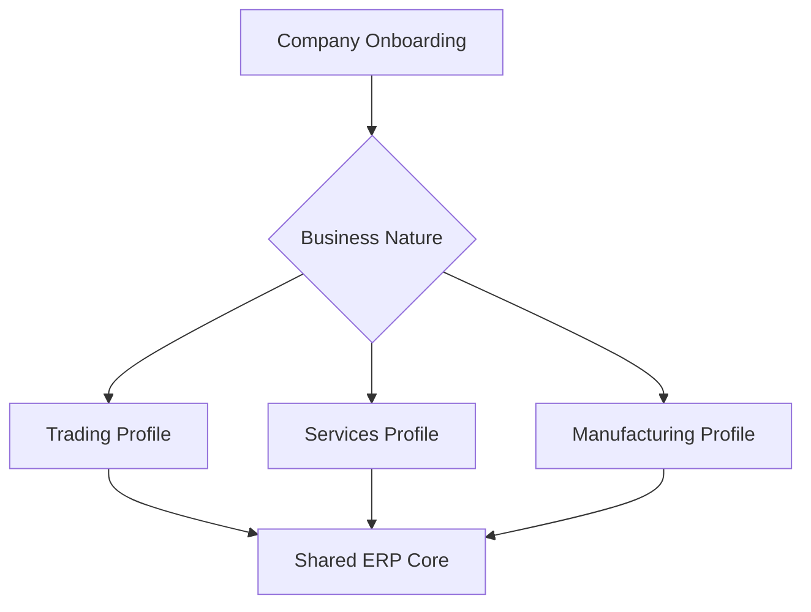
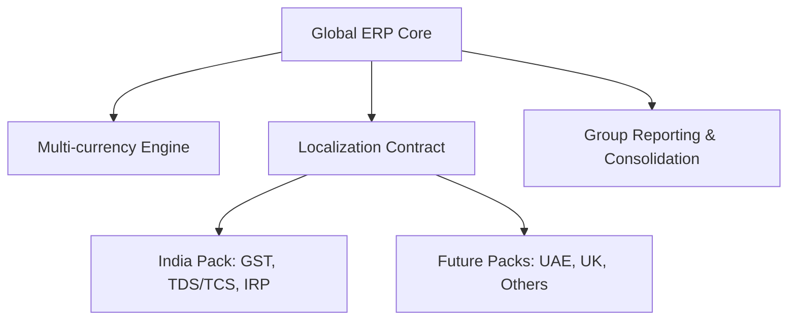

# Elixir Books ERP — Business Requirements Document (BRD)

**Document status:** Draft for stakeholder review  
**Version:** 1.2  
**Date:** 07 September 2026  
**Product:** Elixir Books  

## 1. Executive summary

Elixir Books is a multi-tenant, subscription-based ERP and financial accounting platform for Indian businesses operating through one or more companies, branches, warehouses, stores, and teams. It will provide a single controlled system for accounting, sales, purchase, inventory, POS, banking, payroll, fixed assets, GST compliance, approvals, audit, operational reporting, and management visibility.

The product must support a small business beginning with invoicing and progressively adopting the complete ERP without re-entering master or transaction data. The initial implementation may keep Identity and Books business APIs in the same deployable platform; boundaries must allow Identity to be separated later without changing business-module contracts.

## 2. Business problem

Target organizations commonly operate with disconnected spreadsheets, accounting tools, POS systems, email approvals, bank portals, and manual GST processes. This causes:

- Duplicate and inconsistent customer, supplier, item, and financial data.
- Delayed sales, purchase, collection, and payment processing.
- Manual accounting entries and reconciliation errors.
- Weak control over approvals, credit, budgets, inventory, and access.
- Limited branch-, project-, product-, and employee-level profitability visibility.
- Difficult audit reconstruction and statutory reporting.
- Costly migration when a small business grows beyond simple invoicing.

## 3. Business vision

Create a trusted financial operating system in which every commercial event produces consistent inventory, tax, sub-ledger, general-ledger, audit, and reporting outcomes through shared engines.

### 3.1 Product principles

1. One source of truth for financial and operational data.
2. One accounting posting engine, one tax engine, and one inventory posting engine.
3. Tenant, company, branch, role, and data-scope isolation by default.
4. No hard deletion of posted financial transactions.
5. Every material mutation is attributable and auditable.
6. Lite-to-Pro growth through entitlement changes, not data migration.
7. India-first compliance with extensible country and tax architecture.
8. API-first modular architecture suitable for web, mobile, desktop, and integrations.
9. One functional/base currency per legal company, with multiple transaction currencies.
10. A country-neutral global core extended through versioned localization packs.
11. Business-nature-driven onboarding and workspaces for Manufacturing, Trading, Services, and hybrid companies.

## 4. Business objectives and success measures

| ID | Objective | Target measure |
|---|---|---|
| BO-01 | Establish a governed multi-company ERP platform | 100% of transactions scoped to tenant and company; no cross-tenant exposure |
| BO-02 | Automate order-to-cash | At least 90% of standard sales documents flow without manual journal entry |
| BO-03 | Automate procure-to-pay | At least 85% of approved purchases flow from PO/GRN/invoice into AP |
| BO-04 | Improve inventory accuracy | System stock versus verified physical stock variance below agreed category threshold |
| BO-05 | Reduce month-end effort | Trial balance, P&L, balance sheet, ageing, and tax registers available without spreadsheet consolidation |
| BO-06 | Improve cash visibility | Daily bank, receivable, payable, and cash-position visibility |
| BO-07 | Strengthen governance | 100% of configured approval events and posted-document reversals auditable |
| BO-08 | Support statutory readiness | GST-compliant transaction data and e-invoice/e-way-bill-ready schemas |
| BO-09 | Enable product tiering | Lite customer can upgrade to Pro without master-data or transaction migration |

Final targets must be baselined during pilot discovery.

## 5. Stakeholders

| Stakeholder | Interest / responsibility |
|---|---|
| Platform administrator | Tenants, plans, subscriptions, global settings, support controls |
| Tenant owner | Subscription, companies, users, security, product configuration |
| Company administrator | Branches, periods, masters, numbering, workflows, permissions |
| CFO / Finance head | Controls, closing, cash, compliance, statements, management insight |
| Accountant | Journals, ledgers, receivables, payables, tax, reconciliation, reporting |
| Sales team / manager | CRM, quotation, orders, delivery, invoicing, collections |
| Purchase team / manager | Requisition, RFQ, PO, receipt, matching, supplier liabilities |
| Warehouse team | Receipt, issue, transfer, count, batch/serial, stock accuracy |
| Cashier / POS manager | Billing, shifts, returns, tenders, cash closure |
| HR / Payroll team | Employee, attendance inputs, payroll, payroll accounting |
| Asset custodian | Asset register, transfers, depreciation, disposal |
| Auditor | Immutable history, evidence, traceability, period controls |
| Customer / supplier | Correct documents, statements, receipts, communications |
| Product, engineering, QA, support | Delivery, operation, maintenance, incident resolution |

## 6. Business scope

### 6.1 In scope

1. Platform administration, plans, subscription, feature entitlement, usage control.
2. Identity, authentication, users, invitations, roles, permissions, company/branch scope.
3. Tenant, company, branch, location, financial year, accounting period, configuration.
4. Global, organizational, party, item, pricing, banking, tax, and document masters.
5. Chart of accounts, dimensions, journals, ledgers, opening balances, period close.
6. GST and TDS/TCS calculation foundations.
7. Inventory ledger, warehouse operations, opening stock, adjustments, transfers, valuation.
8. Purchase-to-pay: requisition, RFQ, PO, GRN, optional QC, vendor bill, matching, returns, AP, payment.
9. Order-to-cash: CRM, quotation, sales order, reservation, delivery, invoice, return, credit note, AR, receipt.
10. POS billing, tenders, shifts, return, and day close.
11. Cash/bank vouchers, statement import, matching, reconciliation, payment batches.
12. Approval workflow, delegation, escalation, notification, comments, attachments.
13. Employee expenses, budgets, payroll, and fixed assets.
14. E-invoice, e-way bill, GST return preparation, and statutory exports/integrations.
15. Registers, financial statements, dashboards, exports, audit, and administration.
16. Web application; APIs reusable by mobile and desktop clients.

### 6.2 Out of scope for first release

- Advanced manufacturing planning, finite-capacity scheduling, MES/IoT, and complex shop-floor automation in the first release.
- Advanced supply-chain planning and route optimization.
- Full HR talent suite, recruitment, learning, and performance management.
- Country-specific statutory filing outside the initially approved markets.
- Embedded lending, insurance, or regulated banking services.
- Arbitrary customer-written code inside the transaction engine.

These may be future products or phases and must not distort the initial accounting core.

## 7. Business capability requirements

| ID | Capability | Business requirement | Priority |
|---|---|---|---|
| BR-PLT-01 | Subscription | The platform shall govern plans, trials, renewals, limits, and module entitlements. | Must |
| BR-IAM-01 | Access | Authorized users shall access only permitted tenants, companies, branches, modules, actions, and records. | Must |
| BR-ORG-01 | Organization | A subscription shall support multiple companies; a company shall support multiple branches and locations. | Must |
| BR-FIN-01 | Accounting | All posting modules shall produce balanced, traceable, period-controlled entries. | Must |
| BR-FIN-02 | Closing | Finance shall open, close, lock, and reopen periods under authorization. | Must |
| BR-MDM-01 | Master data | Shared masters shall be governed, reusable, searchable, importable, and auditable. | Must |
| BR-TAX-01 | Tax | The platform shall determine and record GST/TDS/TCS treatment consistently. | Must |
| BR-INV-01 | Inventory | The platform shall maintain warehouse-wise stock quantity, reservation, movement, and value. | Must |
| BR-P2P-01 | Procurement | Users shall process requisition through payment with configurable approval and matching. | Must |
| BR-O2C-01 | Sales | Users shall process quotation through collection, return, and credit adjustment. | Must |
| BR-POS-01 | POS | Stores shall perform fast, controlled billing with inventory and accounting integration. | Should |
| BR-BNK-01 | Banking | Finance shall record and reconcile cash/bank activity and execute controlled payment batches. | Must |
| BR-WFL-01 | Workflow | Business documents shall follow configurable amount-, role-, branch-, and dimension-based approvals. | Must |
| BR-PAY-01 | Payroll | Payroll shall generate salary liabilities, expenses, deductions, and payment outputs. | Should |
| BR-AST-01 | Assets | Finance shall track capitalization, depreciation, movement, revaluation, and disposal. | Should |
| BR-CMP-01 | Compliance | Approved invoices shall support statutory e-invoice/e-way bill/return processes. | Must |
| BR-RPT-01 | Reporting | Operational and financial users shall obtain accurate role-scoped reports and exports. | Must |
| BR-AUD-01 | Audit | All sensitive configuration and transaction changes shall be reconstructable. | Must |
| BR-INT-01 | Integration | External integrations shall be secure, observable, retryable, and idempotent. | Must |
| BR-GLB-01 | Multi-country | A tenant shall operate legal companies in different countries without mixing their statutory books. | Must-foundation |
| BR-FX-01 | Multi-currency | Each company shall have one base currency and support multiple transaction, settlement, reporting, and consolidation currencies. | Must-foundation |
| BR-L10N-01 | Localization | Country-specific tax, registration, invoicing, filing, payroll, and integration behavior shall be delivered through versioned localization packs. | Must-foundation |
| BR-CNS-01 | Consolidation | Authorized users shall produce group reporting in a consolidation currency with traceable translation and future intercompany eliminations. | Future |
| BR-BIZ-01 | Business nature | The product shall adapt onboarding, modules, terminology, masters, workflows, controls, dashboards, and defaults to each company's selected business nature. | Must |
| BR-MFG-01 | Manufacturing | Manufacturing companies shall manage BOM, routing/operations, material planning, production orders, consumption, output, scrap, WIP, and production costing through shared inventory/accounting engines. | Should |

## 8. Major business processes

### 8.1 Tenant onboarding

Subscription → Tenant → Company → Branch → Financial year → Users and access → Masters → Opening balances → Go-live.

### 8.2 Order-to-cash

Lead/opportunity (optional) → Quotation → Sales order → Stock reservation → Delivery → Sales invoice → Receivable → Receipt → Bank reconciliation → Return/credit note when required.

Direct invoicing shall be supported for permitted cases without requiring quotation, order, or delivery.

### 8.3 Procure-to-pay

Purchase requisition → RFQ/quotation (optional) → Purchase order → GRN → Quality inspection (optional) → Vendor invoice → 2/3/4-way match → Approval → Payable → Payment batch → Bank confirmation → Reconciliation → Return/debit note when required.

### 8.4 Record-to-report

Source transaction → Posting engine → Sub-ledger and GL → Adjustments → Reconciliation → Period close → Trial balance → P&L, balance sheet, cash flow → Management dashboard.

### 8.5 Inventory lifecycle

Opening stock/purchase receipt/return receipt → stock ledger → reservation/transfer/adjustment → delivery/POS issue/purchase return → count and valuation.

## 9. Business rules

| ID | Rule |
|---|---|
| BRule-01 | Every posted financial journal must balance debit and credit in transaction and base currency according to configured precision. |
| BRule-02 | Posted documents cannot be edited or deleted; correction requires cancellation, reversal, debit/credit note, or approved adjustment. |
| BRule-03 | Transactions cannot post into a locked period without an authorized reopen process. |
| BRule-04 | Document numbers must be unique within their configured company/branch/type/financial-year series. |
| BRule-05 | Tax is calculated from immutable transaction snapshots of party, item, rate, place of supply, price, discount, and tax treatment. |
| BRule-06 | Master-data changes must not retrospectively alter posted documents. |
| BRule-07 | Stock cannot become negative when the company policy blocks negative stock. |
| BRule-08 | A reversal must link to its source and reverse financial, stock, and tax impact consistently. |
| BRule-09 | Price-list changes must not modify existing documents; selected prices are captured on document lines. |
| BRule-10 | Manual price, discount, credit, and approval overrides require explicit permission and audit. |
| BRule-11 | All external create/post operations must support duplicate prevention or idempotency. |
| BRule-12 | Tenant context is mandatory; company and branch context is mandatory where the business object requires it. |

## 10. Product editions and commercialization

| Edition | Intended customer | Indicative capabilities |
|---|---|---|
| Lite / Smart Invoicing | Micro and small businesses | Customer/item masters, direct invoice, GST, PDF, e-invoice/e-way bill options, receipts, basic reports |
| Pro / Books ERP | Growing multi-branch businesses | Accounting, inventory, purchase, full sales, banking, workflow, statutory reports |
| Enterprise / Custom | Larger organizations | Advanced approvals, integrations, SSO, dimensions, budgets, payroll/assets, custom limits and support |

All editions should share identity, master, and transaction foundations. Subscription entitlements control capability visibility and use.

## 10A. Business-nature operating model

Business nature is a company-level operating profile, separate from subscription edition and country localization. A tenant can own companies with different profiles, and a company may be hybrid.

| Profile | Default operational focus | Default modules and behavior |
|---|---|---|
| Trading | Buy, stock, sell, distribute | Suppliers, purchasing, GRN, warehouses, stock valuation, price lists, sales order, delivery, invoice, returns, AR/AP |
| Services | Sell time, expertise, subscription, milestone, or deliverable | Service catalog, customers, projects/contracts, resources, timesheets/usage/milestones, expense allocation, service invoicing, revenue/receivables |
| Manufacturing | Convert materials into finished/semi-finished goods | BOM, routing/work centres, material planning, production orders, issue/consumption, output, scrap/by-products, WIP, production variance and costing |
| Hybrid | Combine two or more models | Explicitly selected capability combination sharing the same masters and engines |

Business profile controls defaults and navigation but shall not weaken entitlements, permissions, statutory controls, accounting rules, or audit. Authorized administrators may change/add a profile through impact assessment and migration; the system shall never delete or reinterpret historical data.

### Shared versus specialized capability

All profiles reuse company, identity, masters, tax, accounting, inventory where applicable, banking, workflow, documents, reporting, audit, and multi-currency/localization engines. Specialized modules add domain behavior:

- Trading: replenishment, supplier purchasing, inventory availability, distribution fulfilment, landed cost, margin and stock analytics.
- Services: project/contract, resource, time/usage/milestone capture, retainer/advance, deferred/accrued revenue, project profitability and billable expense.
- Manufacturing: engineering/BOM versions, routing, work centre/calendar, MRP, production/WIP, quality, subcontracting, costing and variance.

### Nature-aware onboarding

On selection, the system shall propose—but require review of—module set, chart-of-accounts template, item/service types, document flows, warehouse/work-centre setup, dimensions, tax defaults, roles, approvals, dashboard KPIs, report packs, numbering, and sample import templates. The profile must be versioned, auditable, and overridable within governed constraints.

## 11. Business controls

- Segregation of duties for creation, approval, posting, payment, cancellation, and period reopening.
- Configurable approval thresholds and exception workflows.
- Customer credit limits and overdue controls.
- Supplier invoice duplicate detection.
- Price and discount override limits.
- Stock availability and negative-stock policies.
- PO/GRN/invoice matching tolerances.
- Payment batch approval and maker-checker control.
- Audit evidence for login, configuration, approval, export, posting, reversal, and integration events.

## 12. Information and reporting requirements

Required reporting families:

- Operational registers for all transaction modules.
- Day book, journals, ledgers, trial balance, P&L, balance sheet, and cash flow.
- Customer/supplier outstanding and ageing.
- Stock ledger, availability, valuation, slow/non-moving, movement, and reorder.
- Sales and purchase analytics by period, company, branch, party, item, salesperson, project, and tax.
- GST/TDS/TCS registers and statutory preparation reports.
- Bank book, cash book, unmatched statement items, and reconciliation status.
- Payroll and fixed-asset registers.
- CFO dashboard covering revenue, margin, expense, cash, working capital, budget, project/branch profitability, tax, and forecasts.

## 13. Non-functional business requirements

| Area | Requirement |
|---|---|
| Security | Least privilege, strong authentication, secure secrets, encryption, tenant isolation, and security logging |
| Availability | Business-critical transaction and reporting services shall meet an agreed production SLA |
| Performance | Routine transactional actions shall feel interactive; large reports shall run asynchronously when needed |
| Scalability | Scale tenants, companies, branches, users, documents, journal lines, stock movements, and integrations independently |
| Data integrity | Atomic postings, database constraints, concurrency controls, idempotency, and recoverable workflows |
| Auditability | Immutable evidence with actor, time, source, before/after or business event, and correlation identifiers |
| Localization | Configurable currency, language-ready labels, time zones, formats, tax registrations, and numbering |
| Accessibility | Web experience should target WCAG 2.1 AA for core user journeys |
| Recoverability | Defined backup, point-in-time recovery, disaster-recovery, retention, and restore-testing policy |
| Observability | Trace business transaction, job, integration, error, and performance health end to end |

Quantitative SLOs are defined in the PRD and must be validated through capacity testing.

## 13A. International expansion requirements

### Global core and localization packs

Elixir Books shall use a country-neutral ERP core. Accounting, sales, purchase, inventory, banking, workflow, document numbering, and reporting contracts must not embed India-only assumptions. A company activates a versioned country localization pack.

A localization pack may provide legal registration fields and validation; tax codes, jurisdictions, rates, exemptions, reverse charge, and withholding; statutory invoice fields and templates; return definitions and provider integrations; fiscal-calendar defaults; address/date/number/language formatting; and country payroll rules.

India remains the first operational localization. INR, GST, TDS/TCS, e-invoice, e-way bill, Indian financial-year defaults, and Indian reports may be the only enabled production behavior in early releases, while global contracts and structures exist from the beginning.

### Legal entity and country model

Each company is a separately balanced legal/accounting entity with an ISO country code, legal registrations, registered address, exactly one base currency, fiscal calendar, time zone, default language/locale, localization-pack version, bank accounts, sequences, ledgers, and periods. Transactions and payment batches shall not mix legal companies. Cross-company activity shall use explicit intercompany transactions.

### Currency concepts

| Currency | Purpose |
|---|---|
| Transaction currency | Currency agreed on a document |
| Company base/functional currency | Currency in which the legal company's books balance |
| Settlement currency | Currency actually paid or received |
| Reporting currency | Optional management presentation currency |
| Consolidation currency | Group-level reporting currency |

The currency engine shall support ISO currency code and precision, effective-dated rate types/sources, approved manual/provider rates, rate snapshots, foreign-currency open items, realized gain/loss on settlement, unrealized revaluation, reversal with original context, and reporting/consolidation translation.

Example: a USD 10,000 invoice in an INR-base company posted at ₹83.20 records ₹832,000. Settlement at ₹84.00 records ₹840,000 and ₹8,000 realized exchange gain, subject to fees and rounding policy.

### Consolidation readiness

Group reporting shall preserve company books and translate them into a consolidation currency. Future capability shall support rate policies by account type, cumulative translation adjustment, ownership periods, intercompany matching/elimination, consolidation adjustments, and drill-down to company/base/transaction amounts.

## 14. Assumptions

- India and INR are the first enabled market/base currency, not hard-coded platform assumptions.
- Each legal company has exactly one base currency; changing it after posting requires a controlled migration.
- A tenant may own companies in different countries and currencies, but each company's books balance independently.
- PostgreSQL is the system of record.
- Web is the first complete client; mobile/desktop consume the same APIs.
- Initial architecture is a modular monolith with worker processes and clear domain contracts.
- Identity can reside within the Books platform/API initially and be extracted later.
- GST, e-invoice, e-way bill, bank, email, and payment services may depend on third-party providers.
- Advanced manufacturing is not part of this BRD.

## 15. Dependencies and constraints

- Confirmed accounting policies, tax treatment, invoice formats, chart-of-accounts template, and opening-data quality.
- Provider selection and credentials for GST/e-invoice/e-way bill, messaging, storage, and banking integrations.
- Stakeholder availability for workflow, statutory, and financial-report validation.
- Migration templates and reconciliation ownership for legacy opening data.
- Legal review of data retention, privacy, support access, and statutory obligations.

## 16. Risks and mitigations

| Risk | Impact | Mitigation |
|---|---|---|
| Building screens before shared engines | Inconsistent balances and duplicate logic | Contract-first tax, accounting, inventory, workflow, numbering, and reversal engines |
| Excessive first-release scope | Delayed usable release | Release by vertical business journeys and entitlements |
| Incorrect accounting/tax rules | Financial and compliance exposure | Domain review, golden datasets, invariant tests, controlled pilot |
| Weak tenant isolation | Severe confidentiality breach | Database RLS, scoped authorization, automated isolation tests |
| Poor opening data | Incorrect financial statements | Templates, validation, trial imports, signed reconciliation |
| Third-party outages | Interrupted compliance or communication | Queues, retry, circuit breaker, status visibility, manual fallback |
| Report/ledger divergence | Loss of trust | Reports derive from authoritative ledgers; reconciliation tests |
| Uncontrolled customization | Upgrade and support complexity | Metadata-driven extension within governed boundaries |

## 17. Recommended business release sequence

| Release | Scope | Business outcome |
|---|---|---|
| R1 Foundation | Platform, identity, company/branch, periods, RBAC, masters, audit, numbering | Secure onboarded organization |
| R2 Finance Core | COA, journal/posting, ledgers, opening balances, GST foundation | Accounting-ready platform |
| R3 Sales MVP | Customer/item/pricing, direct invoice, receipt, PDF, sales/GST registers | Bill-to-collect for service/small businesses |
| R4 Inventory & Full Sales | Warehouses, stock ledger, quotation, order, reservation, delivery, return | Complete order-to-cash |
| R5 Purchase & AP | Supplier, PO, GRN, invoice, matching, return, payment | Complete procure-to-pay |
| R6 Banking & POS | Cash/bank, statements, reconciliation, POS | Daily cash and retail operation |
| R7 Compliance | E-invoice, e-way bill, GST returns, TDS/TCS | Statutory automation |
| R8 Control & Enterprise | Budget, expense, payroll, assets, advanced workflow, CFO dashboard | Enterprise financial control |
| R9 International Expansion | FX rates/providers, foreign transactions, revaluation, localization packs, multilingual documents | Multi-country operations |
| R10 Group Finance | Intercompany processing, translation, consolidation adjustments and eliminations | Consolidated group reporting |
| R11 Business Profiles | Trading and Services profiles, hybrid selection, nature-aware onboarding/templates | Adaptive company workspace |
| R12 Manufacturing Core | BOM, routing, MRP, production, WIP, quality, subcontracting and costing | Make-to-stock/make-to-order operation |

## 18. Acceptance and business sign-off

Business acceptance requires:

1. Approved scope and process maps.
2. End-to-end scenarios pass for tenant onboarding, O2C, P2P, inventory, banking, tax, payroll/assets where included, and record-to-report.
3. Opening balances reconcile to the approved source.
4. Trial balance is balanced and source documents drill down to journal and audit evidence.
5. Access, segregation-of-duty, period lock, reversal, and tenant-isolation controls pass.
6. Statutory formats and calculations are signed off by qualified finance/tax stakeholders.
7. Operational support, migration, backup, recovery, and training readiness are accepted.

## 19. Open business decisions

- Final edition packaging, usage limits, and upgrade/downgrade rules.
- GST registration scope at company versus branch level.
- Supported inventory valuation methods in each release.
- Required approval workflows and segregation-of-duty matrix.
- Mandatory country/localization roadmap beyond India.
- Build-versus-buy selection for payroll, GST, bank feeds, and invoice communication.
- Data-retention and support-access policy.
- Pilot companies, volumes, success baselines, and go-live criteria.
- First international countries and localization certification/ownership model.
- Exchange-rate providers, rate hierarchy/types, override controls, and missing-rate policy.
- Reporting/consolidation currency, translation, and intercompany elimination policies.
- Supported business-nature taxonomy, hybrid combinations, and who may change a live company's profile.
- Trading requirements for landed cost, replenishment, distribution, batch/serial, and margin.
- Services requirements for project/contract billing, time/usage/milestones, retainers, revenue recognition, and resource costing.
- Manufacturing depth: discrete/process, make-to-stock/order, BOM/routing, MRP, capacity, quality, subcontracting, WIP and costing methods.
